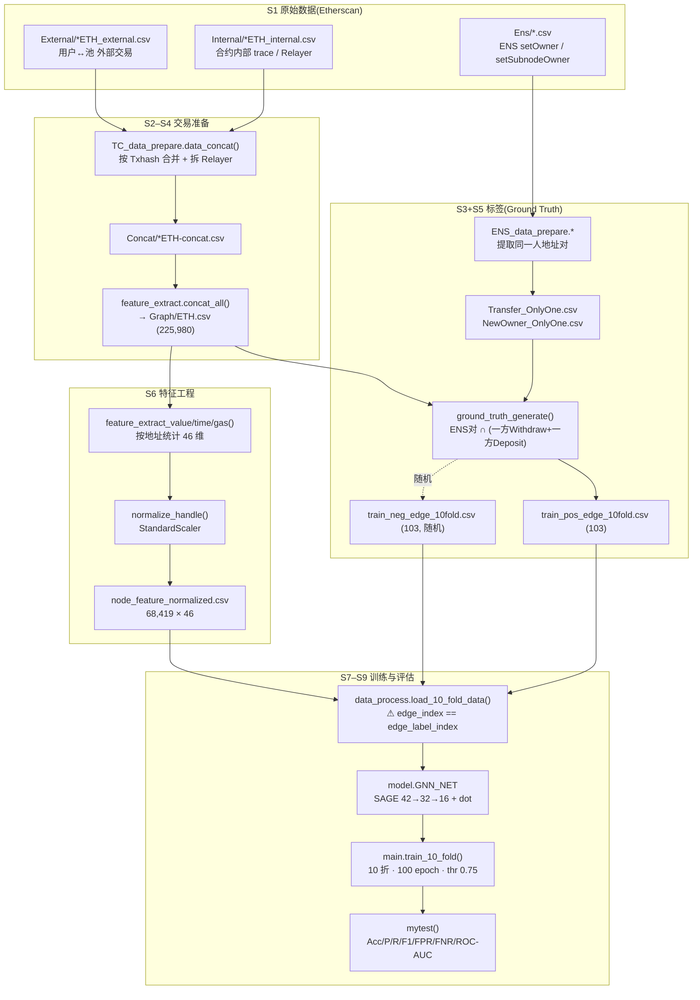
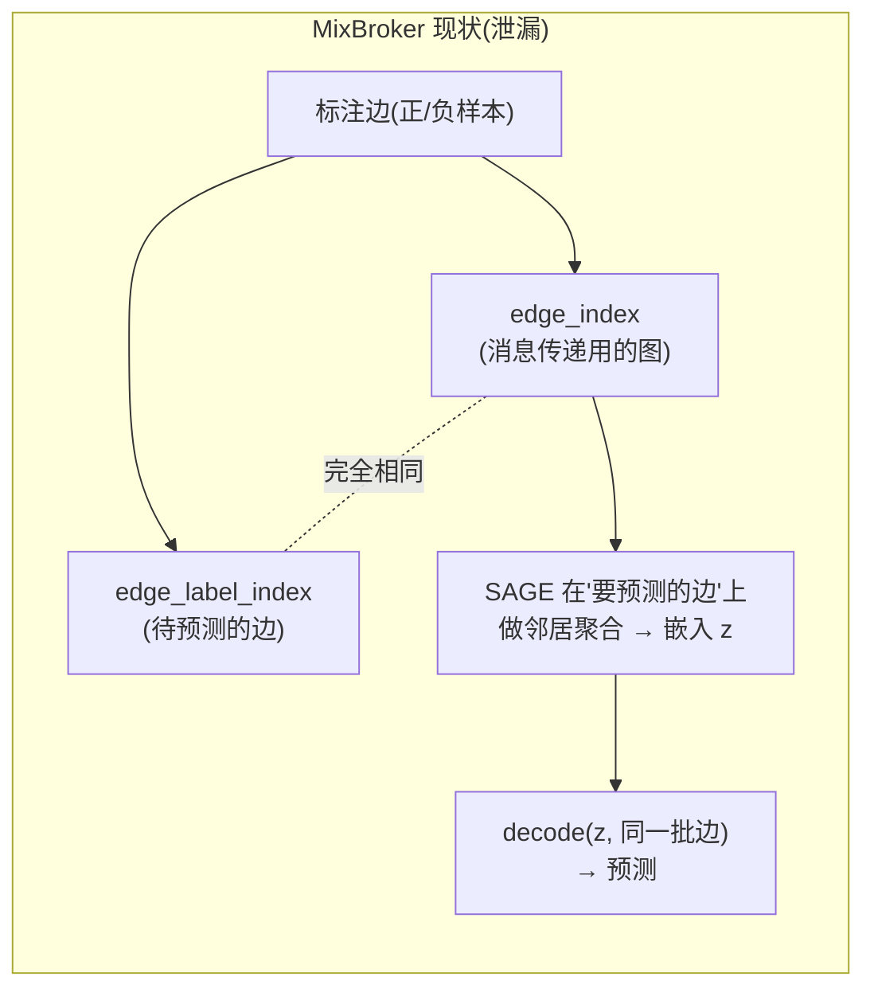
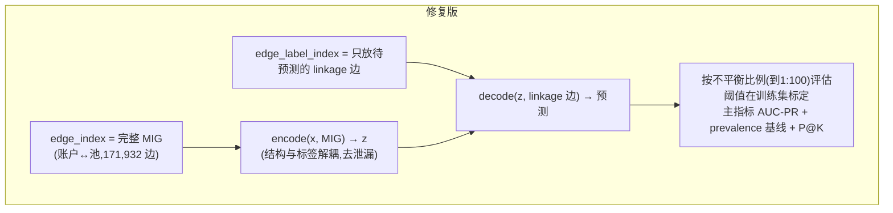

# MixBroker 全流程详解:从数据处理到指标计算 + 泄漏机制 + 改进方案

> 项目:`Breaking the Anonymity of Ethereum Mixing Services Using Graph Feature Learning`(MixBroker, TIFS 2024)
> 目的:把 MixBroker **从原始数据 → 数据准备 → 特征工程 → Ground Truth → 建图 → 训练 → 指标计算**的每一步讲清楚(每步做什么、代码在哪个文件的哪个函数),并说明**标签泄漏是怎么发生的**以及**怎么改进**(附实验证据)。
> 日期:2026-07-03
> 配套:指标含义/优缺点见 [`../docs/evaluation_metrics.md`](../docs/evaluation_metrics.md);图规模/节点边类型见 [`mixbroker_dataset_scale_and_limitations.md`](mixbroker_dataset_scale_and_limitations.md);漏洞对照实验见 [`../output/7.3/report.md`](../output/7.3/report.md)。

---

## 0. 一页速览

MixBroker 判断**两个以太坊地址是否属于同一实体**(混币去匿名化 = 链接预测)。核心任务:在 Tornado Cash 存/取款地址之间,预测哪些(存款地址, 取款地址)对其实是同一个人。

- **正样本**从 **ENS 域名转移**泄露的"同一人"地址对里、再经 TC 存取款验证得到(103 条)。
- **负样本**随机采样(103 条,1:1)。
- **节点特征**是每个地址的 42 维行为统计(各池存取次数、金额、Gas、时间间隔)。
- **模型**是 2 层 GraphSAGE + 点积解码,`sigmoid > 0.75` 判为关联。
- **致命缺陷**:喂给 GNN 做消息传递的图 = 待预测的边本身(`edge_index == edge_label_index`),构成**结构性标签泄漏**;加上 1:1 平衡、随机负样本、固定 0.75、ROC-AUC 主指标,共同虚高了报告分数。

---

## 1. 代码位置总表(每步做什么 · 在哪)

| 阶段 | 文件 | 入口函数 | 做什么 | 主要产物 |
|---|---|---|---|---|
| S1 采集 | — | — | 从 Etherscan 下载 TC 外部/内部交易、ENS 交易 | `Dataset/External,Internal,Ens/*.csv` |
| S2 TC 合并 | [`../TC_data_prepare.py`](../TC_data_prepare.py) | `data_concat()` | 按 `Txhash` 合并内外部交易,还原真实收款人(拆 Relayer) | `Dataset/Concat/{p}ETH-concat.csv` / `-relayer.csv` |
| S3 ENS 清洗 | [`../ENS_data_prepare.py`](../ENS_data_prepare.py) | `data_clean_ens` / `extract_ens_transfer` / `extract_ens_newowner` / `name_transfer` / `subdomain_assignment` | 提取 `setOwner`/`setSubnodeOwner`,去自转移与重复 → "同一人"地址对 | `Dataset/Ens/Transfer_OnlyOne.csv` / `NewOwner_OnlyOne.csv` |
| S4 建 ETH.csv | [`../feature_extract.py`](../feature_extract.py) | `concat_all()` | 合并四池 concat + gas,排序 | `Dataset/Graph/ETH.csv`(225,980 行) |
| S5 Ground Truth | [`../ground_truth_generate.py`](../ground_truth_generate.py) | `ground_truth_generate()` → `find_nodeid()` | ENS 对经"一方存一方取"验证 → 正样本边;映射为 nodeid | `ens_edge.csv` → `train_pos_edge_10fold.csv`(103) |
| S5' 负采样 | (仓库无脚本) | — | 随机非关联地址对 | `train_neg_edge_10fold.csv`(103) |
| S6 特征工程 | [`../feature_extract.py`](../feature_extract.py) | `feature_extract_value/time1/time2/gas1/gas2` → `normalize_handle` | 按地址统计 46 维特征并标准化 | `node_feature.csv` → `node_feature_normalized.csv`(68,419×46) |
| S7 建图 | [`../data_process.py`](../data_process.py) | `load_10_fold_data()` | 装载特征 + 边 → PyG `Data`(**此处发生泄漏**) | 内存 `Data` 对象 |
| S8 模型 | [`../model.py`](../model.py) | `GNN_NET` | 2 层 SAGEConv(42→32→16)+ 点积解码 | — |
| S9 训练/评估 | [`../main.py`](../main.py) | `train_10_fold()` / `mytest()` | 10 折 KFold,100 epoch,阈值 0.75,best-by-F1 | 7 项指标 mean±std |

---

## 2. 端到端主流程图



---

## 3. 逐阶段详解(做什么 · 代码 · 输入输出)

### S2 · TC 交易合并 — [`TC_data_prepare.py`](../TC_data_prepare.py) `data_concat()`
对 `[0.1, 1, 10, 100]` 四个池:读 `External`(用户可见交易)与 `Internal`(合约内部 trace)。
- **循环 1**(遍历外部交易):按 `Txhash` 匹配内部 trace。若某 Txhash 恰有 **2 条内部记录 → Relayer 模式**(第三方代付/代提),从内部记录还原真实收款人写入 concat,同时记录 relayer 信息;否则直接写外部行。
- **循环 2**(剩余内部交易):`num==2` 为 Withdraw+Relayer;否则按金额列判 Deposit / Withdraw。
- **输出**:`Concat/{p}ETH-concat.csv`(`Txhash,UnixTimestamp,DateTime,From,To,Value_IN,Value_OUT,Method`)与 `-relayer.csv`。

### S3 · ENS 地址对 — [`ENS_data_prepare.py`](../ENS_data_prepare.py)
- `data_clean_ens(f)`:删除 `IsError==1` 失败交易(`usecols=[0,2,4,5,6,12,13]`)。
- `extract_ens_transfer()`:筛 `Method=='setOwner(bytes32 node, address owner)'` → `Transfer.csv`。
- `extract_ens_newowner()`:筛 `setSubnodeOwner(...)` → `NewOwner.csv`。
- `name_transfer()`:删 `From==New` 自转移,**按 From 去重(`keep=False`)** → `Transfer_OnlyOne.csv`。
- `subdomain_assignment()`:删自转移,按 `[From,New]` 去重 → `NewOwner_OnlyOne.csv`。
- **要义**:A 把 ENS 域名转给 B → 链上公开暴露 **A、B 属于同一实体**,是正样本标签的来源。

### S4 · 汇总 ETH.csv — [`feature_extract.py`](../feature_extract.py) `concat_all()`
合并四池 `*ETH-concat.csv`,与 `*ETH-external-gas.csv` 按 `Txhash` merge 出 `GasPrice`,按 `From,To` 排序 → `Dataset/Graph/ETH.csv`(**225,980 笔**:Deposit 103,673 + Withdraw 96,323 + 少量杂项)。全部是 `账户→池` 形式。

### S5 · Ground Truth — [`ground_truth_generate.py`](../ground_truth_generate.py)
- `ground_truth_generate()`:取 ENS 地址对 `(ac_1, ac_2)`,在 `ETH.csv` 中验证:
  - `ac_1` 有 **Withdraw** 且 `ac_2` 有 **Deposit** → 正边 `[ac_2, ac_1]`;
  - `ac_2` 有 **Withdraw** 且 `ac_1` 有 **Deposit** → 正边 `[ac_1, ac_2]`。
  即"一个地址存币、另一个地址取币,且二者 ENS 同主"→ 判为同一实体的存取款对。产物 `ens_edge.csv`(地址对)。
  > 注:该函数 L43 有 `df_new` 未定义的 bug(见 `training_test_pipeline.md` §A.14,应为 `df_new_1`)。
- `find_nodeid()`:把地址映射为 `node_feature_normalized.csv` 里的整数 `nodeid` → `train_pos_edge_10fold.csv`(**103 条正边**)。
- **负样本**:仓库无独立脚本,为**随机采样的无关联地址对**(103 条),构成 1:1。

### S6 · 特征工程 — [`feature_extract.py`](../feature_extract.py)
按 `From`(地址)分组,统计 46 维:
- `feature_extract_value()`:按 `To` 识别 4 个池,统计各池交易次数、存/取次数、`value_d/w`、`avg_value_d/w` → `node_feature.csv`(计数+金额 19 维)。
- `feature_extract_time1()`(全部)/`time2()`(存/取):首末时间、相邻交易时间间隔的 min/max/avg/total(18 维)。
- `feature_extract_gas1()`(全部)/`gas2()`(存/取):GasPrice min/max/avg(9 维)。
- `normalize_handle()`:丢弃 `nodeid,node`,对其余列 `StandardScaler` 标准化 → `node_feature_normalized.csv`(**68,419 节点 × 46 特征**)。
> 训练时(S7)再丢弃 `node, value_d, value_w, avg_value_d, avg_value_w` 5 列 → **实际输入 GNN 42 维**。
> ⚠ 仓库的 `time2`/`gas2` 只实现了 Withdraw 循环(缺 Deposit 循环),完整 46 维需用 `Graph_original_backup/` 或补全(见 `training_test_pipeline.md` §A.8/§A.14)。

### S7 · 建图 — [`data_process.py`](../data_process.py) `load_10_fold_data()`
装载标准化特征为 `x`(`inf→1, nan→0`),把边端点地址映射为特征表行索引,构建 PyG `Data`。**关键行 [`data_process.py:41`](../data_process.py#L41)**:
```python
data = Data(x=x, edge_index=edges, edge_label=labels, edge_label_index=edges)
#                          ^^^^^ 消息传递图              ^^^^^ 待预测边  ——  二者相同!
```

### S8 · 模型 — [`model.py`](../model.py) `GNN_NET`
`encode`: `SAGEConv(42→32).relu()` → `SAGEConv(32→16)` 得节点嵌入 `z`;`decode`: `(z[u]*z[v]).sum()` 内积得边 logit。

### S9 · 训练/评估 — [`main.py`](../main.py) `train_10_fold()` + `mytest()`
- `KFold(n_splits=10, shuffle=True, random_state=42)` 对**正、负样本分别切分**再合并;每折训练新模型 100 epoch,`Adam lr=0.01`,`BCEWithLogitsLoss`;`epoch>10` 后取**测试集 F1 最高**的 epoch。
- `mytest()`:`sigmoid > 0.75` 二值化,手写累计 TP/FP/FN/TN,算 **Accuracy / Precision / Recall / F1 / FPR / FNR / ROC-AUC**;10 折取 mean±std。

---

## 4. 指标是怎么算的(S9 细节)

判决:`label_pred = (sigmoid(decode(...)) > 0.75)`([`main.py:37`](../main.py#L37))。

| 指标 | 公式 | 代码 |
|---|---|---|
| Accuracy | (TP+TN)/N | `sm.accuracy_score` |
| Precision | TP/(TP+FP) | `sm.precision_score` |
| Recall | TP/(TP+FN) | `sm.recall_score` |
| F1 | 2PR/(P+R) | `sm.f1_score`(**选模主指标**) |
| FPR | FP/(FP+TN) | 手写 |
| FNR | FN/(TP+FN) | 手写 |
| ROC-AUC | ROC 曲线下面积 | `sm.roc_auc_score`(**传连续概率**,阈值无关) |

> 各指标的意义、优缺点、以及为何应补 **AUC-PR / Precision@K**:见 [`../docs/evaluation_metrics.md`](../docs/evaluation_metrics.md)。

---

## 5. 泄漏是怎么发生的

### 5.1 结构性标签泄漏(核心)



因为 [`data_process.py:41`](../data_process.py#L41) 令 `edge_index == edge_label_index`:**模型做消息传递用的图,就是它要预测的那批边本身**。2 层 SAGE 直接在"待预测边"上聚合邻居 = 把"哪些点被连在一起"(而正样本恰恰是被连起来的同一人对)喂给编码器;测试折同理。**答案的连接结构泄漏进了输入**,评估被系统性高估。

同时:论文强调的完整交互图(MIG,22.6 万笔 账户↔池 交易)**从未进入模型**;6.8 万节点中约 **99% 是孤立死点**(仅载入特征、从不参与消息传递)。GNN 退化为"在 395 点、206 边的极小图上做链路预测",近乎纯特征分类器。(详见 [`mixbroker_dataset_scale_and_limitations.md`](mixbroker_dataset_scale_and_limitations.md)。)

### 5.2 另外三重虚高(评估设定层面)

| 缺陷 | 位置 | 后果 |
|---|---|---|
| **1:1 平衡** | S5' 负采样 | 真实是"所有存款×所有取款"极度不平衡(prevalence ~10⁻⁵),1:1 严重乐观 |
| **无约束随机负样本** | S5' | 混入(存,存)之类一眼假的对,难度虚低(实测:换成语义正确硬负样本,同 1:1 下 F1 0.85→0.76) |
| **固定阈值 0.75** | [`main.py:37`](../main.py#L37) | 平衡集标定,迁移到不平衡即失配,Recall 崩 |
| **ROC-AUC 主指标** | `mytest` | 对不平衡"免疫",掩盖 base-rate 现实 |

---

## 6. 怎么改进(方案 + 实验证据)

### 6.1 改进对照图(暴露版 → 修复版)



### 6.2 四处改进

1. **修复泄漏**:让 `edge_index` = 完整 MIG(账户↔池),`edge_label_index` 只取待预测边,使二者不再相等。代码见 [`../output/7.3/_code/build_mig.py`](../output/7.3/_code/build_mig.py)(建 MIG)+ [`sweep_runner_fixed.py`](../output/7.3/_code/sweep_runner_fixed.py)(`--graph mig`)。
2. **真实(不)平衡比例**:负采样扩到 1:100 / 1:1000,并报告 base rate。
3. **语义正确 + 难负样本**:强制(存款→取款)配对(已做),再纳入同池/同额/邻近时间的困难对。
4. **阈值标定 + 时间切分**:阈值在训练/验证集按 F1 标定(而非固定 0.75);按 `UnixTimestamp` 做时间切分;主指标改 **AUC-PR / Precision@K**。

### 6.3 实验证据(原生数据,详见 [`../output/7.3/report.md`](../output/7.3/report.md))

| 结论 | 证据 |
|---|---|
| ROC-AUC 对不平衡免疫 | 1:1→1:10 全程 0.70–0.96 几乎持平 |
| 换 AUC-PR 立刻显形 | 原生 AUC-PR 0.78→0.37(腰斩),F1 0.76→0.37 |
| 去泄漏在原生影响小 | AUC-PR 仅降 0.01–0.04(原生 MIG 只 4 池 hub,结构平凡,模型本就吃特征) |
| 阈值标定救回 F1/Recall | 每档 F1@标定 > F1@0.75;最优阈值 t* 随不平衡 0.52→0.79,证明 0.75 失配 |
| 真实比例是最大虚高源 | 去泄漏+标定后,1:100 时 AUC-PR 仅 0.083、F1 仅 0.09,而 ROC 仍 0.68 |

---

## 7. 一句话总结

MixBroker 的流程本身工整(TC 合并 → ENS 标签 → 42 维行为特征 → GraphSAGE 链路预测),但**在 [`data_process.py:41`](../data_process.py#L41) 令 `edge_index == edge_label_index` 造成结构性标签泄漏**,叠加 **1:1 平衡 + 无约束随机负样本 + 固定 0.75 阈值 + ROC-AUC 主指标**,共同把报告分数系统性抬高。改进核心是:**用完整 MIG 做消息传递、按真实不平衡比例评估、阈值在验证集标定、主指标换 AUC-PR/Precision@K**——已在 `output/7.3/` 用对照实验逐项定量验证。
