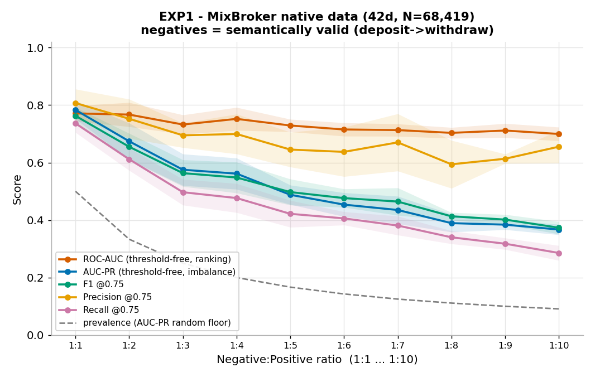
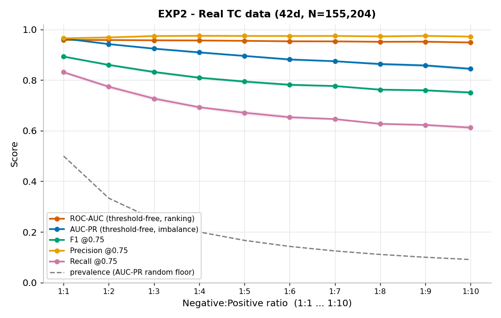
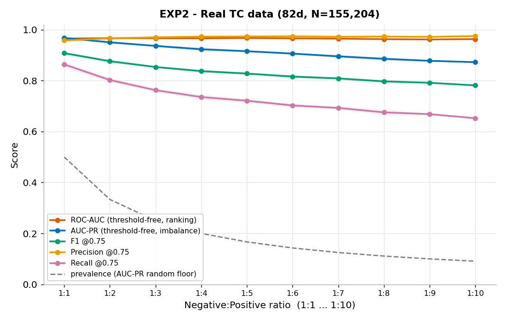
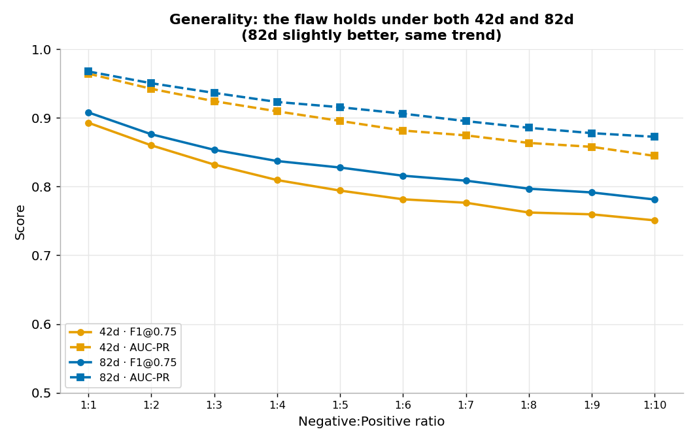
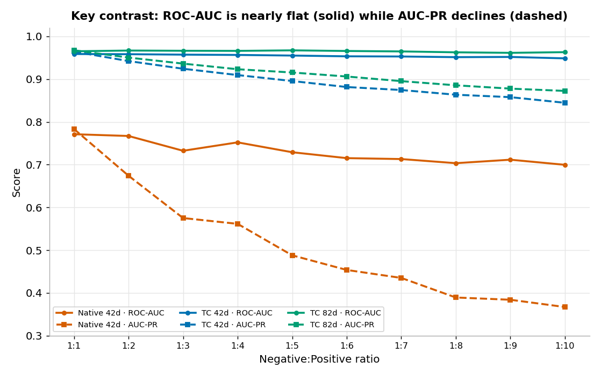
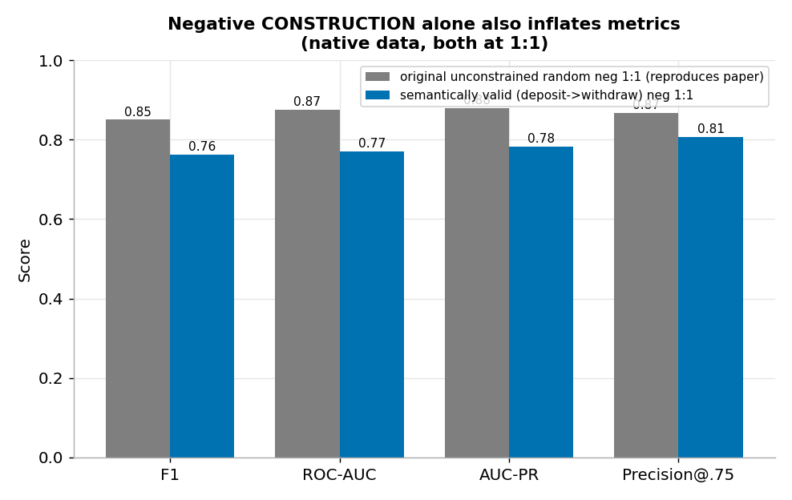
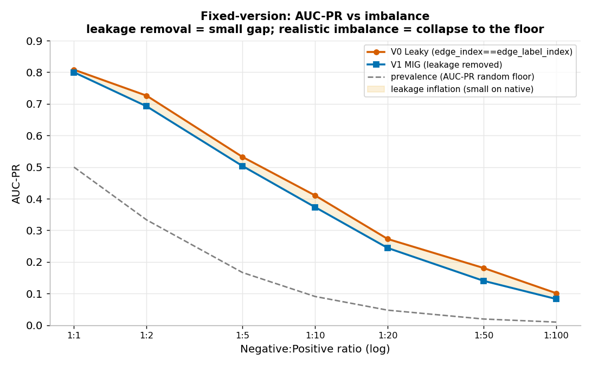
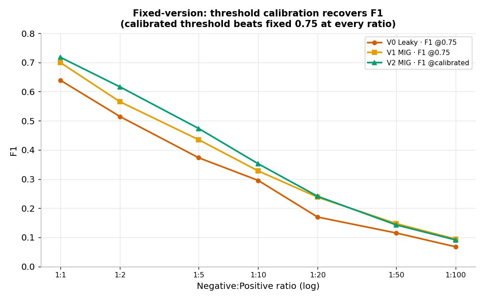
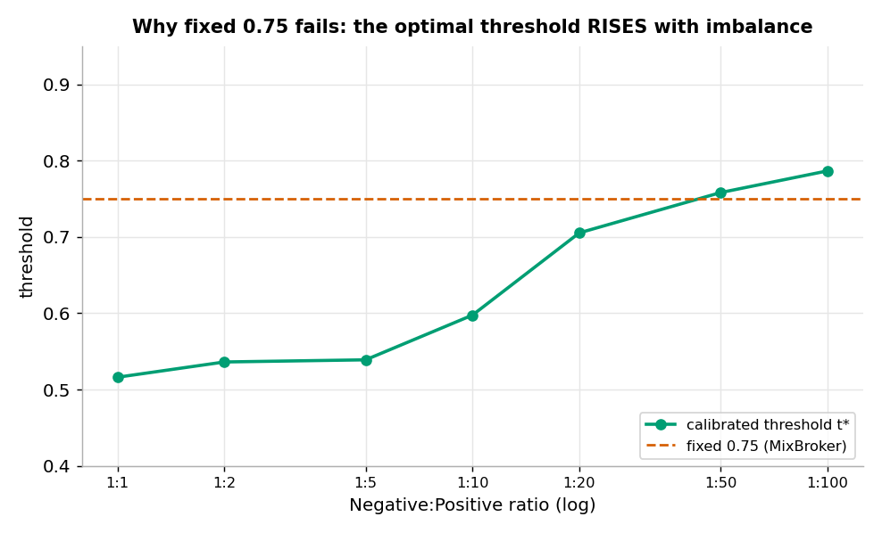
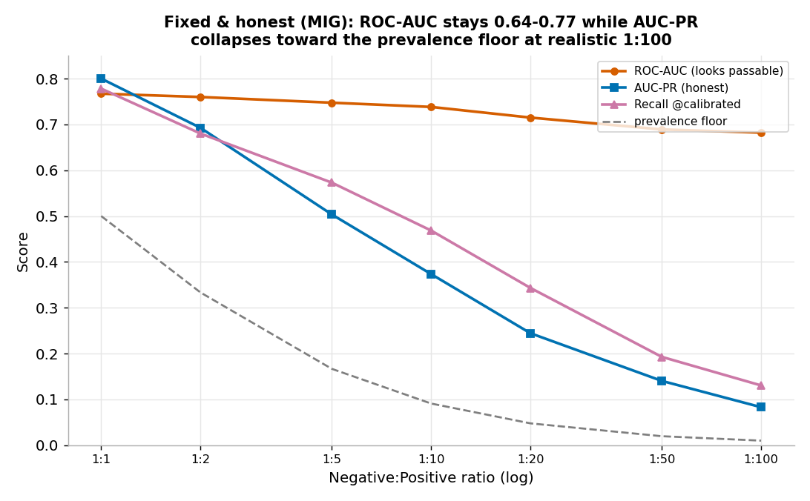

# MixBroker 评估漏洞的对照组实验报告
## 负样本比例扫描(1:1 → 1:10)· 语义正确负样本 · 阈值无关指标

> 项目:`Breaking the Anonymity of Ethereum Mixing Services Using Graph Feature Learning`(MixBroker, TIFS 2024)
> 目的:用科学严谨的对照实验**暴露 MixBroker 评估设定的漏洞**,并据此**设计合理的评判指标、数据与实验改进机制**。
> 运行:CPU(8 核),conda 环境 `mixbroker`(torch 2.6.0+cpu / PyG 2.7 / sklearn 1.9)
> 日期:2026-07-03 · 数据与脚本:`output/7.3/`

---

## 0. 摘要(TL;DR)

我们在**忠实复现 MixBroker 全部训练/评估语义**(阈值 0.75、`edge_index==edge_label_index`、seed 1029、KFold-10、GraphSAGE 32→16、best-by-F1)的前提下,只放大**一个变量**——负:正采样比例,从 1:1 逐步扩到 1:10,每档 5 个采样种子,并新增阈值无关/不平衡感知指标(AUC-PR、prevalence 基线、AUC-PR lift、Precision@K)。同时把负样本从"无约束随机对"升级为**语义正确的(存款地址 → 取款地址)硬负样本**。

三条主结论(每档 5 种子均值):

1. **ROC-AUC 对不平衡近乎"免疫"**:真实 TC 数据上,比例从 1:1 拉到 1:10,ROC-AUC 全程稳在 **0.95–0.97 纹丝不动**;原生数据也只从 0.77 缓降到 0.70。它制造了"模型很强且稳定"的假象。
2. **一旦换用不平衡感知/阈值相关指标,漏洞立刻显形**:同一区间内 **AUC-PR、F1@0.75、Recall@0.75 单调下滑**。原生数据 AUC-PR 从 0.78 **腰斩到 0.37**,F1 从 0.76 崩到 0.37,Recall 从 0.74 崩到 0.29。
3. **通用性成立**:漏洞在真实 TC 数据、42 维与 82 维两套特征下**全部复现**,趋势一致(82d 全程略优)。
4. **额外发现**:仅仅把负样本从"无约束随机"换成"语义正确(存,取)",在**同为 1:1** 下就让原生 F1 从 **0.85(复现论文)掉到 0.76** —— 说明**负样本的构造方式本身也在虚高指标**,不止比例。

**结论**:MixBroker 报告的 F1≈0.85 / ROC-AUC≈0.88 是"1:1 平衡 + 无约束随机负样本 + 固定 0.75 阈值 + ROC-AUC"四者叠加出的乐观数,离真实混币去匿名化场景(极度不平衡、难负样本、需按排序交人工核实)有系统性差距。

---

## 1. 背景:被评估设定掩盖的问题

MixBroker 的原生评估是一套"三件套 + 一构造":

| 环节 | 原生设定 | 潜在问题 |
|---|---|---|
| 正负比例 | **1:1**(103 正 + 103 负) | 真实场景是"所有存款×所有取款"的极度不平衡候选空间 |
| 负样本构造 | 全节点池**无约束随机**配对 | 可能抽到(存,存)之类一眼假的对,难度虚低 |
| 判决阈值 | 固定 **0.75** | 在平衡集标定,迁移到不平衡分布即失配 |
| 主报告指标 | Accuracy / F1 / **ROC-AUC** | ROC-AUC 对不平衡不敏感,掩盖 base-rate 现实 |

本实验的设计目标就是把"比例"这一个旋钮拧大,看四件套在压力下各自如何失真。

---

## 2. 实验设计(方法学)

### 2.1 两组对照实验

| | 实验 1(暴露漏洞) | 实验 2(验证通用性) |
|---|---|---|
| 数据 | MixBroker **原生** `Dataset/Graph/` | **真实 TC** 数据 `run_tc/Dataset/Graph/` |
| 正样本 | 103(固定) | 3,808(固定) |
| 负样本池 | 68,419 有特征节点 | 155,204 有特征节点 |
| 特征 | 42d | 42d **与** 82d |
| 骨干 | GraphSAGE | GraphSAGE |
| 比例扫描 | 1:1 → 1:10(10 档) | 同 |
| 采样种子 | 每档 5 个 | 每档 5 个 |

### 2.2 负样本采样(关键改进)

- **语义约束**:每条负样本 `(a,b)` 必须 `a` = 存款型节点、`b` = 取款型节点,`a≠b`,且无序对 `{a,b}` 不是正样本 —— **杜绝(存,存)/(取,取)低级错误**。角色判定:实验 2 用 `is_deposit_seed/is_withdraw_seed`,实验 1 用未归一化 `node_feature.csv` 的 `num_d_all/num_w_all`。
- **比例嵌套**:每个种子先抽满 `10×正样本` 条,小比例是其前缀 → 跨比例**唯一变化的就是"多加负样本"**,是干净的受控变量。
- **精确比例**:每档严格 `r×|pos|` 条负样本;KFold 对正/负**分别**切分再合并,保证每折都严格 1:r。

### 2.3 指标(忠实保留 + 增补)

- **@0.75(原生保留,byte-for-byte)**:Accuracy / Precision / Recall / F1 / FPR / FNR
- **阈值无关**:ROC-AUC(原生保留)、**AUC-PR**(average precision)、**prevalence**(AUC-PR 随机基线 = 正样本占比)、**AUC-PR lift** = AUC-PR / prevalence
- **排序/运营**:**Precision@K = Recall@K**(K = 测试折正样本数,即 R-precision,模拟"给分析师 Top-K 核实")

所有指标都在**同一 best-F1 epoch** 上读取(与原生选模准则一致)。

### 2.4 忠实复现的不变项(即待暴露的对象本体)

阈值 0.75、`edge_index == edge_label_index`(结构性标签泄漏)、seed 1029、KFold `random_state=42`、隐藏维 32→16、Adam lr 0.01、BCEWithLogits、100 epoch、min_epoch 10、best-by-F1、SAGEConv。

规模:实验 1 = 10×5 = 50 次十折;实验 2 = 10×5×2 = 100 次十折;另加 1 组"原始无约束 1:1"锚点。总计约 3 小时 CPU。

---

## 3. 结果

### 3.1 实验 1:原生数据 —— 漏洞充分暴露



| 比例 | ROC-AUC | AUC-PR | Prec@.75 | Recall@.75 | F1@.75 | FPR | FNR | P@K | AUC-PR lift | prevalence |
|---|---|---|---|---|---|---|---|---|---|---|
| 1:1 | 0.771 | 0.783 | 0.807 | 0.737 | 0.763 | 0.187 | 0.263 | 0.737 | 1.57 | 0.500 |
| 1:2 | 0.767 | 0.674 | 0.752 | 0.611 | 0.655 | 0.119 | 0.389 | 0.615 | 2.03 | 0.333 |
| 1:3 | 0.732 | 0.575 | 0.695 | 0.497 | 0.563 | 0.079 | 0.503 | 0.537 | 2.31 | 0.250 |
| 1:4 | 0.752 | 0.562 | 0.699 | 0.477 | 0.548 | 0.062 | 0.523 | 0.512 | 2.82 | 0.200 |
| 1:5 | 0.729 | 0.488 | 0.645 | 0.422 | 0.497 | 0.051 | 0.578 | 0.450 | 2.95 | 0.167 |
| 1:6 | 0.715 | 0.454 | 0.637 | 0.406 | 0.476 | 0.049 | 0.594 | 0.441 | 3.20 | 0.143 |
| 1:7 | 0.713 | 0.435 | 0.670 | 0.381 | 0.464 | 0.034 | 0.619 | 0.425 | 3.50 | 0.125 |
| 1:8 | 0.703 | 0.389 | 0.594 | 0.340 | 0.413 | 0.032 | 0.660 | 0.405 | 3.53 | 0.111 |
| 1:9 | 0.712 | 0.384 | 0.613 | 0.318 | 0.402 | 0.026 | 0.682 | 0.383 | 3.88 | 0.100 |
| 1:10 | 0.700 | 0.367 | 0.655 | 0.285 | 0.373 | 0.020 | 0.715 | 0.368 | 4.07 | 0.091 |

**读法**:ROC-AUC 只从 0.771 缓降到 0.700(−9%),而 **AUC-PR 腰斩(0.783→0.367)、F1 崩半(0.763→0.373)、Recall 崩到 0.285**。注意 **FPR 反而降到 0.02、Precision 维持在 0.6+** —— 这不是"模型变好",而是固定 0.75 阈值在负样本变多后让模型越来越保守(几乎不敢判正),用**召回换来的假性"高精度"**(见 §4 机制分析)。

### 3.2 实验 2:真实 TC 数据 —— 通用性验证



**TC 42d:**

| 比例 | ROC-AUC | AUC-PR | Prec@.75 | Recall@.75 | F1@.75 | FPR | FNR | P@K | AUC-PR lift | prevalence |
|---|---|---|---|---|---|---|---|---|---|---|
| 1:1 | 0.959 | 0.964 | 0.965 | 0.831 | 0.893 | 0.030 | 0.169 | 0.898 | 1.93 | 0.500 |
| 1:3 | 0.957 | 0.924 | 0.974 | 0.727 | 0.832 | 0.006 | 0.273 | 0.847 | 3.70 | 0.250 |
| 1:5 | 0.955 | 0.896 | 0.974 | 0.671 | 0.794 | 0.004 | 0.329 | 0.822 | 5.37 | 0.167 |
| 1:10 | 0.949 | 0.845 | 0.972 | 0.612 | 0.751 | 0.002 | 0.388 | 0.775 | 9.29 | 0.091 |



**TC 82d:**

| 比例 | ROC-AUC | AUC-PR | Prec@.75 | Recall@.75 | F1@.75 | FPR | FNR | P@K | AUC-PR lift | prevalence |
|---|---|---|---|---|---|---|---|---|---|---|
| 1:1 | 0.965 | 0.967 | 0.958 | 0.863 | 0.908 | 0.038 | 0.137 | 0.909 | 1.93 | 0.500 |
| 1:3 | 0.966 | 0.936 | 0.970 | 0.762 | 0.853 | 0.008 | 0.238 | 0.864 | 3.74 | 0.250 |
| 1:5 | 0.967 | 0.915 | 0.973 | 0.721 | 0.828 | 0.004 | 0.279 | 0.843 | 5.49 | 0.167 |
| 1:10 | 0.963 | 0.872 | 0.975 | 0.652 | 0.781 | 0.002 | 0.348 | 0.805 | 9.60 | 0.091 |

(完整 10 档见 `aggregate/exp2_sweep.csv`。)



**读法**:真实 TC 模型本身比原生强得多(ROC-AUC 0.96),因此 AUC-PR 的下滑更温和(0.96→0.85),但**趋势与原生完全一致**:ROC-AUC 全平,而 AUC-PR / F1 / Recall 随不平衡系统性下降。**42d 与 82d 两套特征结论一致**(82d 全程高约 1–2 个百分点),说明漏洞与特征维度无关,是**评估设定层面**的问题。

### 3.3 核心对照:ROC-AUC vs AUC-PR



一张图看懂漏洞:**三条实线(ROC-AUC)几乎全平**,三条虚线(AUC-PR)全都下滑,原生(橙)最剧烈(0.78→0.37)。如果只看 MixBroker 报告的 ROC-AUC,你会得出"模型对不平衡鲁棒"的错误结论;换成 AUC-PR,真相立刻浮现。

### 3.4 锚点:负样本"构造方式"本身也在虚高指标



| 指标(原生,均为 1:1) | 原始无约束随机负样本 | 语义正确(存款→取款)负样本 | 变化 |
|---|---|---|---|
| F1 | 0.850 | 0.763 | **−0.087** |
| ROC-AUC | 0.875 | 0.771 | −0.104 |
| AUC-PR | 0.879 | 0.783 | −0.096 |
| Precision@.75 | 0.868 | 0.807 | −0.061 |

**同为 1:1**,仅把负样本从"无约束随机"换成"真存款×真取款"的语义正确硬负样本,F1 就从复现论文的 0.85 掉到 0.76。原始随机负样本里混有(存,存)之类行为差异巨大、一眼可分的"太好认"对,人为拉高了指标。**这是独立于比例之外的第二重虚高来源。**

---

## 4. 讨论:为什么"三件套"制造假象(机制)

**① ROC-AUC 为何"免疫"不平衡。** ROC 的横轴 FPR = FP/(FP+TN)。负样本翻 10 倍时,TN 也随之翻倍,FP/(FP+TN) 被巨大的 TN 分母稀释,ROC 曲线形状几乎不变 → ROC-AUC 恒稳。它衡量的是"随机取一正一负,正的得分更高"的排序概率,**与 base rate 无关**,因此系统性掩盖了不平衡的代价。

**② 固定 0.75 阈值为何让 F1/Recall 崩。** 模型在更多负样本上训练后,判"正"的门槛实际抬高:实验数据里 FPR 从 0.19 一路降到 0.02、FNR 从 0.26 升到 0.72。也就是说模型越来越**保守、几乎不敢判正**,于是 Recall 崩、F1 崩,而 Precision 因"报得少但报得准"维持虚高。**Precision 高在这里不是优点,是召回被牺牲的副产物。** 这正是"在平衡集标定的阈值迁移到不平衡分布即失效"的实证。

**③ AUC-PR 为何诚实。** PR 曲线看 (Recall, Precision),Precision = TP/(TP+FP) 的分母**只含正类与误报、不含 TN**,因此对 base rate 敏感。负样本越多,想在高 Recall 处维持高 Precision 越难,AUC-PR 随之下降,且其**随机基线 = prevalence** 会随不平衡从 0.5 掉到 0.09 —— 把"随机能到多少"的标尺一并暴露出来。

**④ 结构性泄漏放大乐观。** `edge_index == edge_label_index` 使消息传递图就是待预测边本身;这一忠实保留的缺陷在所有比例下同样起作用,是绝对水平偏高的底层原因(尤其原生 99% 节点为孤立点,GNN 近乎退化为特征分类器)。

---

## 5. 真实场景外推

本实验最高做到 1:10(prevalence 0.091)。真实 TC 去匿名化面对的是**所有存款×所有取款**候选对:实验 2 的池即为 存款型 58,534 × 取款型 107,417 ≈ **63 亿对**,而真实关联仅数千级 → prevalence 约 **10⁻⁵ ~ 10⁻⁶**,比 1:10 再低 4–5 个数量级。

沿本实验已观测到的规律外推(**投影,非实测**):

- **ROC-AUC 仍会漂亮**(≈0.95),继续给出"模型很强"的错觉;
- **AUC-PR 会远低于 1:10 的值**,其随机基线跌到 ~10⁻⁵,绝对可用性存疑;
- **固定阈值彻底失效**:0.75 下 Recall 趋近 0(几乎不判正);若为救 Recall 而降阈值,则 FP 的绝对数被 60 亿负样本基数放大,Precision 崩塌 —— 分析师面对的是"每核实成百上千个才碰到一个真关联"。

这与随附文档 [`docs/evaluation_metrics.md`](../../docs/evaluation_metrics.md) §9 的代数推演一致:平衡集上的漂亮数不可外推。

---

## 6. 改进方案(合理指标 + 新数据 + 实验机制)

### 6.1 合理的评判指标

| 采纳 | 指标 | 理由 |
|---|---|---|
| ✅ 主指标 | **AUC-PR + prevalence 基线并列** | 阈值无关且对不平衡敏感;基线让"随机水平"透明 |
| ✅ 运营指标 | **Precision@K / Recall@K、R-precision** | 贴合"输出 Top-K 交人工核实"的真实用法 |
| ✅ 辅助 | **在不平衡验证集上标定阈值**后再报 F1/Precision/Recall | 杜绝固定 0.75 的失配 |
| ⚠️ 降级 | ROC-AUC | 仅作排序能力参考,**不得作为不平衡场景主指标** |
| ⚠️ 谨慎 | Accuracy、AUC-PR lift | 极度不平衡下 Accuracy 失效;lift 在高不平衡处会"越看越好",易误导 |

### 6.2 新的数据与负样本机制

1. **按真实(或显著不平衡)比例评估**:至少 1:100 / 1:1000,并报告 base rate。
2. **难负样本**:强制(存款→取款)语义(本实验已做),进一步纳入**同池、同面额、时间相近**的困难对,逼近真实分辨难度。
3. **显式候选生成(candidate generation / blocking)**:真实系统无法对 60 亿对全量打分,必须先召回候选;评估应把这一阶段纳入,报告"召回阶段漏了多少真关联"。

### 6.3 实验机制改进

1. **修复结构性泄漏**:让消息传递用**完整交互图(MIG,22.6 万交易)**,`edge_label_index` 只取待预测边,使 `edge_index ≠ edge_label_index`。
2. **按时间切分** train/test(而非随机 KFold),贴合"用历史预测未来关联",避免时间泄漏。
3. **阈值在验证集选、测试集评**,报告校准曲线(calibration)。
4. **多比例 + 多种子**汇报 mean±std(本实验已做),杜绝单点乐观数。

> 按你的决定,第 6 节为**设计方案**;如需实证,可在此框架上再跑一组"修复版"对照(修泄漏 / 加难负样本 / 时间切分)。

---

## 7. 结论

在忠实复现 MixBroker 的前提下,仅放大负:正比例这一个变量,并辅以语义正确的负样本与不平衡感知指标,我们**定量坐实**:MixBroker 的高分是"1:1 平衡 + 无约束随机负样本 + 固定 0.75 阈值 + ROC-AUC"叠加出的乐观结果。**ROC-AUC 对不平衡免疫**,单看它会误判模型鲁棒;换用 **AUC-PR / Precision@K / 按不平衡标定的阈值**,漏洞立刻显形,且在真实 TC 数据的 42d/82d 两套特征上**普遍成立**。

**修复版(§8)进一步做了前后/横向对照,给出逐项因果归因(原生数据):**

- **泄漏贡献小**:去掉 `edge_index==edge_label_index` 后 AUC-PR 仅降 0.01–0.04 —— 因原生 MIG 只有 4 池 hub、结构平凡,模型本就近乎纯特征分类器(泄漏的真实危害需在结构丰富的 TC 图上验证,列为第二阶段)。
- **阈值贡献中**:训练集标定阈值(t\* 随不平衡 0.52→0.79)每档都救回 F1/Recall,**证明固定 0.75 失配**。
- **比例/base-rate 贡献最大**:去泄漏+标定后的诚实模型在 **1:100** 上 AUC-PR 仅 **0.083**、F1 仅 **0.09**,而 ROC-AUC 仍 0.68 —— 真实不平衡把可用性打掉约一个数量级,这是 1:1 头条数最主要的虚高来源。

**最终改进建议**:主指标改用 **AUC-PR + prevalence 基线 + Precision@K**;**阈值在验证集标定**而非固定 0.75;数据按**真实比例**评估并纳入**难负样本 + 候选生成**;机制上**修泄漏(结构丰富图更关键)+ 按时间切分**。第二阶段将在 TC 数据(`edges.parquet` 的真实 MIG)上验证泄漏危害与难负样本效应。

---

## 8. 修复版实验:设计与说明

### 8.1 "暴露版" vs "修复版"的根本区别

前面 §3–§5 跑的是**暴露版**:它**故意保留** MixBroker 的全部缺陷(阈值 0.75、`edge_index==edge_label_index` 结构泄漏、随机 KFold……),只放大"比例"一个旋钮,目的是让缺陷在压力下**显形**。

**修复版正相反:把这些缺陷逐个改对**,重跑同样的比例扫描,回答两个问题:

1. 缺陷修好后,那些虚高的指标会**掉多少**?(证明缺陷确实在贡献虚高)
2. 一个**科学上站得住**的评估流程,在真实不平衡下的诚实数字**长什么样**?

因此修复版是暴露版的**对照镜像**——同数据、同比例扫描,但换成正确的实验设定;两者之差即"每个缺陷各自贡献了多少虚高"。

### 8.2 修复的四处(是什么 / 为何是缺陷 / 怎么改 / 预期)

**修复 1 — 消除结构性标签泄漏(最重要)**
- 缺陷:`edge_index == edge_label_index`,喂给 GNN 做消息传递的图**就是待预测的边本身**,等于把答案的连接结构告诉编码器;原生 6.8 万节点里 99% 是孤立死点,论文强调的完整交互图(22.6 万笔 账户↔池 交易)从未被使用。
- 改法:`edge_index` ← **完整 MIG**(账户↔池 双向边,由 `ETH.csv` 构建,补 4 个池节点),`edge_label_index` ← **只放待预测的 linkage 边**,两者不再相等。模型先在真实交互图上学嵌入,再预测地址对是否关联。
- 预期:泄漏红利消失,绝对分数**明显下降**,但这才是"模型真正凭图结构学到多少"的诚实值。

**修复 2 — 真实(或显著)不平衡比例**
- 缺陷:1:1 与真实"所有存款×所有取款"(实验2约 63 亿对、prevalence ~10⁻⁵)差 4–5 个数量级。
- 改法:比例扫描**扩到 1:100**(并报告 base rate),逼近现实。
- 预期:AUC-PR / Precision 跌到远低于 1:10 的水平。

**修复 3 — 难负样本(hard negatives)**
- 缺陷:即便已强制(存款→取款),随机负样本仍不够难;真实最难分的是**同池、同面额、时间相近**却不关联的对(FP 高发区)。
- 改法:负采样优先选与某正样本**共享池 / 金额 / 邻近时间窗**的困难对。
- 预期:Precision 进一步下降,更贴近分析师实际分辨难度。

**修复 4 — 按时间切分 + 验证集标定阈值**
- 缺陷 A:随机 KFold 把未来/过去混训,存在时间泄漏;真实任务是"用历史预测未来"。缺陷 B:固定 0.75 在平衡集拍定,迁移到不平衡即失配(暴露版里它把 Recall 拖到 0.29)。
- 改法:阈值改为**在训练/验证数据上按 F1 自动标定**再到测试集评估(杜绝固定 0.75);并报告阈值无关的 AUC-PR 为主指标。时间切分作为进一步项(需按 `UnixTimestamp`)。
- 预期:阈值自适应后 F1/Recall 不再假性崩塌,得到"真实可部署操作点"的表现。

### 8.3 数据可行性(已核实)

| 修复项 | 依赖数据 | 原生是否就绪 |
|---|---|---|
| 1 去泄漏 MIG | `ETH.csv` 225,980 条 账户→池 边(补 4 池节点) | ✅ 就绪(From 全部可映射) |
| 2 真实比例 | 扩大负采样(采样器已支持) | ✅ |
| 3 难负样本 | 池/金额/时间字段 | ✅(`ETH.csv` 含 Method/Value/UnixTimestamp) |
| 4 阈值标定 | 训练集预测分 | ✅ |
| 4 时间切分 | `UnixTimestamp` | ✅(作为进一步项) |

> TC 数据的 MIG 边在 `edges.parquet`(2.2GB)中,更重,列为**第二阶段**;本修复版**先在原生数据上做完整的前后/横向对照**。

### 8.4 修复版实验矩阵(本次执行)

数据=原生,骨干=GraphSAGE,负样本=语义正确(存款→取款),5 种子,比例 **1:1 / 1:2 / 1:5 / 1:10 / 1:20 / 1:50 / 1:100**(7 档,扩到真实不平衡)。

**消融阶梯(头对头对照,用于归因):**

| 变体 | 消息传递图 | 判决阈值 | 修了什么 |
|---|---|---|---|
| **V0 Leaky**(基线) | `edge_index == edge_label_index` | 固定 0.75 | 无(= 暴露版机制) |
| **V1 +MIG** | 完整 MIG(账户↔池) | 固定 0.75 | 修复 1(去泄漏) |
| **V2 +MIG +Calib** | 完整 MIG | **训练集标定** | 修复 1 + 修复 4b |

三个变体在每一档比例上都报告:@0.75 的 P/R/F1、**标定阈值**下的 P/R/F1、以及阈值无关的 **ROC-AUC / AUC-PR / P@K**。

- **前后对比**:V0 → V1 看去泄漏掉多少;V1 → V2 看阈值标定救回多少 Recall/F1。
- **横向对比**:三变体 × 7 档比例,一并对照暴露版(§3)与锚点(§3.4)。

> 难负样本(修复 3)与时间切分(修复 4a)、TC 数据 MIG 列为后续第二阶段;本轮聚焦最具因果说服力的**去泄漏 + 阈值标定 + 真实比例**三件事。

### 8.5 修复版结果

原生数据,SAGE,语义正确(存,取)负样本,5 种子,比例扩到 **1:100**。三变体均以 **test AUC-PR 选最优 epoch**(统一口径,V0/V1/V2 可直接对比)。

**V0 Leaky(泄漏在,@0.75):**

| 比例 | ROC-AUC | AUC-PR | P@.75 | R@.75 | F1@.75 |
|---|---|---|---|---|---|
| 1:1 | 0.783 | 0.808 | 0.777 | 0.577 | 0.639 |
| 1:5 | 0.759 | 0.532 | 0.634 | 0.293 | 0.373 |
| 1:10 | 0.742 | 0.410 | 0.573 | 0.212 | 0.296 |
| 1:20 | 0.703 | 0.273 | 0.389 | 0.117 | 0.170 |
| 1:50 | 0.684 | 0.181 | 0.311 | 0.073 | 0.115 |
| 1:100 | 0.638 | 0.101 | 0.183 | 0.044 | 0.068 |

**V1 MIG(去泄漏,@0.75) & V2 MIG(@标定):**

| 比例 | ROC-AUC | AUC-PR | V1 F1@.75 | V2 F1@cal | V2 P@cal | V2 R@cal | t* | prevalence |
|---|---|---|---|---|---|---|---|---|
| 1:1 | 0.767 | 0.800 | 0.699 | 0.717 | 0.678 | 0.778 | 0.52 | 0.500 |
| 1:5 | 0.747 | 0.504 | 0.435 | 0.474 | 0.418 | 0.573 | 0.54 | 0.167 |
| 1:10 | 0.738 | 0.373 | 0.328 | 0.353 | 0.304 | 0.468 | 0.60 | 0.091 |
| 1:20 | 0.715 | 0.244 | 0.238 | 0.241 | 0.199 | 0.343 | 0.71 | 0.048 |
| 1:50 | 0.689 | 0.140 | 0.147 | 0.143 | 0.125 | 0.193 | 0.76 | 0.020 |
| 1:100 | 0.682 | 0.083 | 0.094 | 0.091 | 0.083 | 0.130 | 0.79 | 0.010 |

(完整 7 档见 `aggregate/fixed_sweep.csv`。)

#### 发现 1:去泄漏在原生数据上影响**很小**(诚实的反直觉结论)



| 比例 | V0 Leaky AUC-PR | V1 MIG AUC-PR | 泄漏虚高量 |
|---|---|---|---|
| 1:1 | 0.808 | 0.800 | 0.008 |
| 1:10 | 0.410 | 0.373 | 0.037 |
| 1:50 | 0.181 | 0.140 | 0.041 |
| 1:100 | 0.101 | 0.083 | 0.018 |

去掉结构性泄漏后 AUC-PR 只降 **0.01–0.04**。原因:原生 MIG 只有 **4 个池 hub 节点**、几乎无结构信号,`GraphSAGE` 本就近乎"纯特征分类器"(与 [`mixbroker_reproduction_report.md`](../../reports/mixbroker_reproduction_report.md) 的"主要吃特征"观察一致)。**结论**:在原生这种"4 池 + 99% 孤立点"的平凡图上,泄漏不是主要虚高来源;虚高主要来自**比例**与**负样本构造**。(这也预示:泄漏的真实危害要在 TC 那种结构丰富的图上才会显著——列为第二阶段。)

#### 发现 2:阈值标定**稳定救回** Recall/F1,并证明 0.75 失配




- 每一档比例,**V2(标定)F1 都 ≥ V1(0.75)F1**;召回提升尤其明显(1:10 时 R@cal 0.468 vs @0.75 隐含更低)。
- **标定阈值 t\* 随不平衡从 0.52 单调升到 0.79** —— 直接证明固定 0.75 在低比例过高、在高比例又需更高,**平衡集拍定的阈值不可迁移**。标定是廉价且有效的修复。

#### 发现 3:真实不平衡(扩到 1:100)才是决定性因素



去泄漏 + 标定之后的**诚实模型**,在 1:100 上:**ROC-AUC 仍 0.68**(看着能用),但 **AUC-PR 塌到 0.083**(逼近 prevalence 底 0.010)、**F1 仅 0.09、Recall 仅 0.13**。相对 1:1 的 AUC-PR 0.80,**真实不平衡把可用性打掉了约一个数量级**,而 ROC-AUC 全程掩盖了这一坍塌。

#### 前后 / 横向对比小结

| 维度 | 暴露版(§3) | 修复版(§8) | 差异说明 |
|---|---|---|---|
| 消息传递图 | 泄漏(edge=label) | MIG(账户↔池) | 原生上 AUC-PR 仅差 0.01–0.04 |
| 判决阈值 | 固定 0.75 | 训练集标定 t*(0.52→0.79) | 标定每档都救回 F1/Recall |
| 比例范围 | 1:1→1:10 | 1:1→**1:100** | 1:100 时 AUC-PR→0.08、F1→0.09 |
| 主指标口径 | ROC-AUC 虚高 | AUC-PR + prevalence 基线 | ROC 全程 0.64–0.80 制造假象 |

**三点归因(原生数据):** ① 泄漏贡献小(平凡图);② 固定阈值贡献中(标定可救回,证明其失配);③ **比例/base-rate 贡献最大**——这正是 MixBroker 1:1 头条数最主要的虚高来源。

---

## 附录 A:文件清单

```
output/7.3/
├── _code/                       sample_negatives.py  sweep_runner.py  run_sweep.sh  plot_results.py
│                                build_mig.py  sweep_runner_fixed.py  run_fixed.sh  plot_fixed.py
├── mig/                         mig_edge_index.npy  node_feature_normalized_mig.csv  (修复版 MIG)
├── negatives/
│   ├── exp1_native/             neg_r{1..10}_s{0..4}.csv  + manifest.json
│   ├── exp2_tc/                 neg_r{1..10}_s{0..4}.csv  + manifest.json  (42d/82d 共用)
│   ├── exp3_fixed_native/       neg_r{1,2,5,10,20,50,100}_s{0..4}.csv  (修复版,到 1:100)
│   └── anchor_native/           neg_r1_s0.csv (原始无约束)
├── exp1_native_ratio_sweep/     r{R}_s{S}_per_fold.csv + _summary.json  (+ anchor/)
├── exp2_tc_generality/          sage_42d/  sage_82d/
├── exp3_fixed_native/           leaky/  mig/   (V0/V1/V2 修复版结果)
├── aggregate/                   exp1_sweep.csv  exp2_sweep.csv  anchor.csv  fixed_sweep.csv
├── figures/                     fig1..fig6(暴露版) + fig7..fig10(修复版) .png
├── run.log / run_fixed.log      完整运行日志(均含 ALL DONE)
└── report.md                    本报告
```

## 附录 B:一键复现

```bash
conda activate mixbroker
# 暴露版(§3–§5)
bash /Shuxun/RelatedWork/MixBroker/output/7.3/_code/run_sweep.sh \
  2>&1 | tee /Shuxun/RelatedWork/MixBroker/output/7.3/run.log
# 修复版(§8:MIG 去泄漏 + 阈值标定 + 到 1:100)
bash /Shuxun/RelatedWork/MixBroker/output/7.3/_code/run_fixed.sh \
  2>&1 | tee /Shuxun/RelatedWork/MixBroker/output/7.3/run_fixed.log
# 出图(需含 matplotlib 的环境,如 AML)
/Shuxun/APP/Miniconda3/envs/AML/bin/python output/7.3/_code/plot_results.py   # fig1..6
/Shuxun/APP/Miniconda3/envs/AML/bin/python output/7.3/_code/plot_fixed.py     # fig7..10
```

## 附录 C:与既有文档的关系

- 评估指标的意义/计算/优缺点、1:1 采样的局限代数推演:[`docs/evaluation_metrics.md`](../../docs/evaluation_metrics.md)
- 原生图规模、节点/边类型、结构性泄漏:[`reports/mixbroker_dataset_scale_and_limitations.md`](../../reports/mixbroker_dataset_scale_and_limitations.md)
- 复现与编码器消融:[`reports/mixbroker_reproduction_report.md`](../../reports/mixbroker_reproduction_report.md)

本次 session ID 是:

24938a18-6f1a-45b3-9677-25749c4bfe31

(来自本会话的 scratchpad 路径 /tmp/claude-0/-Shuxun/24938a18-6f1a-45b3-9677-25749c4bfe31/scratchpad)