# MixBroker 数据准备 · 模型训练 · 测试流程说明

> 项目：Breaking the Anonymity of Ethereum Mixing Services Using Graph Feature Learning  
> 复现时间：2026-06-03  
> 运行环境：`conda activate mixbroker`（Python 3.10 / PyTorch 2.6.0+cu124 / RTX 4080 SUPER）

**文档结构**

| 部分 | 内容 |
|------|------|
| **第一部分（§1–§13）** | 流程说明、图表、实验结果与一键复现（原有文档） |
| **附录（§A.1 起）** | 代码级复现详解：函数、字段、张量、命令与排错（新增） |

---

## 1. 项目目标

MixBroker 针对 **Tornado Cash** 以太坊混币服务，利用 **Mixing Interaction Graph (MIG)** 上的图神经网络，学习地址节点特征与边关系，从而判断两个地址是否属于同一实体（**去匿名化 / 链接攻击**）。

| 概念 | 说明 |
|------|------|
| 节点 | 参与 Tornado Cash 交易的以太坊地址 |
| 边 | 待判定的地址对 `(nodeid1, nodeid2)` |
| 正样本 (label=1) | ENS 域名转移暴露的真实关联地址对 |
| 负样本 (label=0) | 随机采样的无关联地址对 |
| 任务类型 | 边分类（Link Prediction / Edge Classification） |

---

## 2. 端到端流程总览

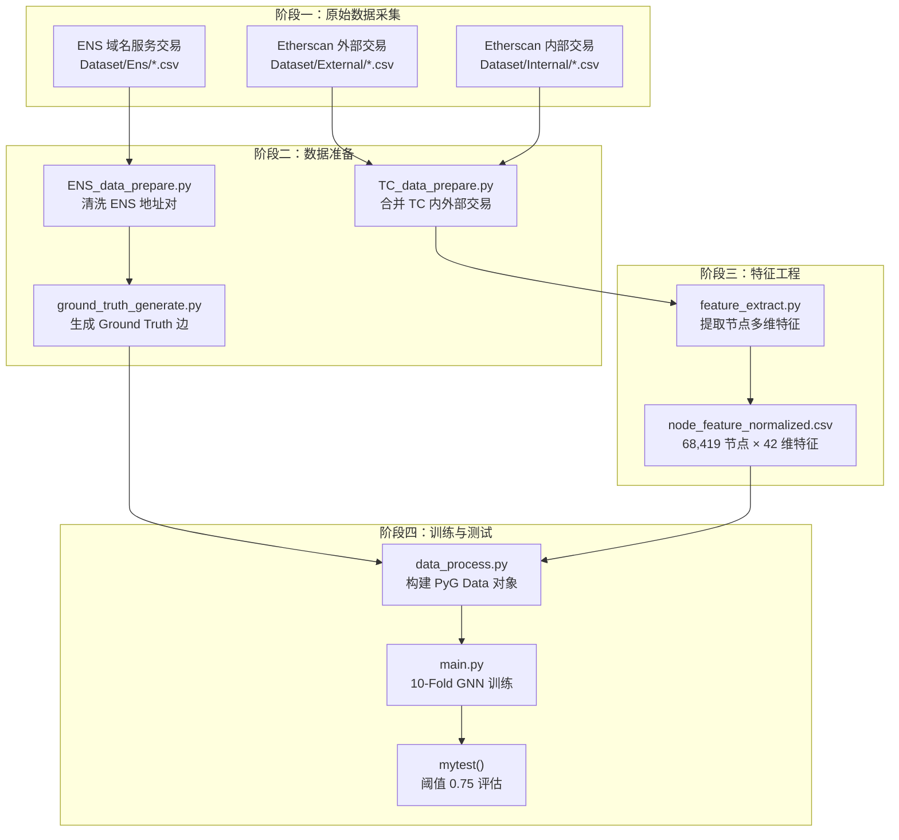

**阶段一 · 原始数据采集**

| 节点 | 含义 | Demo |
|------|------|------|
| A1 | Etherscan **外部交易**：用户 ↔ TC 混币合约的可见转账 | `External/0.1ETH_external.csv`：`From=0x0039f22e...` → `To=0x12d66f87...`，`Method=Deposit`，`Value_IN=0.1` |
| A2 | **内部交易**：同一 `Txhash` 下合约内部 trace（Withdraw、Relayer） | `Internal/0.1ETH_internal.csv`：池合约 → 用户，`Value_OUT=0.1` |
| A3 | **ENS 交易**：域名 `setOwner` / `setSubnodeOwner`，用于构造“已知同一人”标签 | `Ens/Transfer_OnlyOne.csv`：`From` 将域名转给 `New` |

```
# A1 外部交易 Demo
Txhash: 0xcfa3a64a54e0...
From: 0x0039f22efb07a647557c7c5d17854cfd6d489ef3  →  To: 0x12d66f87...（0.1 ETH 池）
Method: Deposit   Value_IN(ETH): 0.1
```

**阶段二 · 数据准备**

| 节点 | 含义 | Demo |
|------|------|------|
| B1 | `TC_data_prepare.py`：按 `Txhash` 合并内外部 → `Concat/*ETH-concat.csv` | `From, To, Method=Deposit/Withdraw` |
| B2 | `ENS_data_prepare.py`：清洗 ENS → `Transfer_OnlyOne.csv` | `From=0x8a58...`, `New=0x8472...`, `Method=setOwner(...)` |
| B3 | `ground_truth_generate.py`：ENS 关联 + TC 存取款验证 → 正/负样本边 | `train_pos_edge_10fold.csv`：`nodeid1=30926, nodeid2=65961, label=1` |

```
# B3 正样本边 Demo
nodeid1=30926, nodeid2=65961, label=1
→ 0x72a637e2... 与 0xf70ae467...（同一实体）
```

**阶段三 · 特征工程**

| 节点 | 含义 | Demo |
|------|------|------|
| C1 | `feature_extract.py`：按地址统计池次数、Gas、时间间隔 | 输入 `Graph/ETH.csv`（225,980 行） |
| C2 | `StandardScaler` 后 **68,419 节点 × 42 维** | `node_feature_normalized.csv` 节选：`nodeid=0, 0.1_num=-0.079, avg_gasprice_all=0.803` |

**阶段四 · 训练与测试**

| 节点 | 含义 | Demo |
|------|------|------|
| D1 | `load_10_fold_data()` → PyG `Data` | `x=[68419,42]`, 训练折 `edge_index=[2,184]` |
| D2 | `main.py` 10-Fold，GraphSAGE 100 epoch | pos/neg 各 103 条边 |
| D3 | `mytest()`，sigmoid > **0.75** 判关联 | 负样本：`nodeid1=25203, nodeid2=47658, label=0` |

---

## 3. 数据集目录结构

```
Dataset/
├── External/          # Tornado Cash 外部交易（4 个混币池：0.1/1/10/100 ETH）
├── Internal/          # Tornado Cash 内部交易（含 Relayer 调用）
├── Concat/            # 内外部合并后的完整交易 + Relayer 数据
├── Ens/               # Ethereum Name Service 交易（用于构造 Ground Truth）
└── Graph/             # 图节点特征 + 训练/测试边数据
```

### 3.1 各阶段数据规模

| 目录 | 文件 | 行数（约） | 用途 |
|------|------|-----------|------|
| External | 0.1/1/10/100 ETH_external.csv | 205万 ~ 305万 | 原始链上外部交易 |
| Internal | 0.1/1/10/100 ETH_internal.csv | 1190万 ~ 2764万 | 原始链上内部交易 |
| Concat | *ETH-concat.csv | 703万 ~ 1510万 | 合并后的 TC 完整交易 |
| Concat | *ETH-relayer.csv | 174万 ~ 438万 | Relayer 中继交易 |
| Ens | Transfer_OnlyOne.csv | 698万 | 唯一 ENS 转移记录 |
| Ens | NewOwner_OnlyOne.csv | 106万 | 唯一 ENS 子域分配记录 |
| Graph | ETH.csv | **225,980** | 汇总后的 TC 交易图基础数据 |
| Graph | ens_edge.csv | 105 | ENS 暴露的关联边 |
| Graph | node_feature_normalized.csv | **68,419** | 标准化节点特征 |
| Graph | train_pos_edge_10fold.csv | **103** | 正样本边（label=1） |
| Graph | train_neg_edge_10fold.csv | **103** | 负样本边（label=0） |

### 3.2 Tornado Cash 四个混币池合约

| 池名称 | 合约地址 |
|--------|----------|
| 0.1 ETH | `0x12D66f87A04A9e220743712cE6d9bB1B5616B8Fc` |
| 1 ETH | `0x47CE0c6eD5B0Ce3d3A51Fdb1C52DC66a7c3C2936` |
| 10 ETH | `0x910bCd523d972eb0a6f4CaE2368AD62622b39DbF` |
| 100 ETH | `0xA160cdAB225685dA1d56aa342Ad8841c0b3BA25b` |

---

## 4. 数据准备（三步骤）

> 本次复现可直接使用仓库预置的 `Dataset/Graph/` 数据；以下说明各脚本逻辑，完整重建需按顺序执行。代码级步骤见**附录 §A.4–§A.7**。

### 4.1 Step 1：Tornado Cash 交易合并

**脚本：** `TC_data_prepare.py` → `data_concat()`

```bash
python TC_data_prepare.py
```

**处理逻辑：**

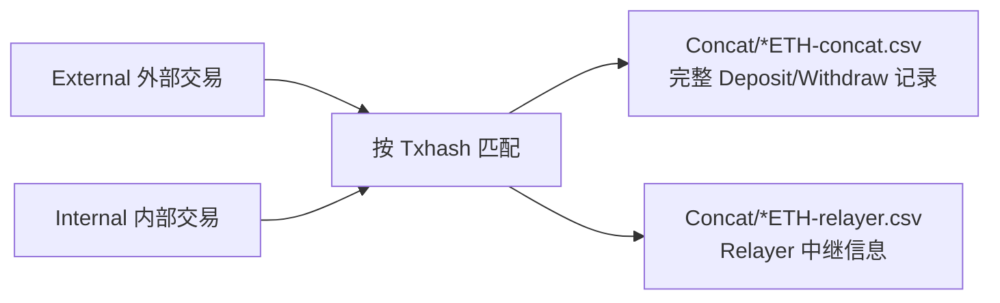

| 节点 | 含义 | Demo |
|------|------|------|
| External | 用户与 TC 池合约的链上可见交易（存币等） | `To=0x12d66f87...`，`Method=Deposit` |
| Internal | 同 `Txhash` 的合约内部转账（取币/Relayer） | `Value_OUT=0.1`，池 → 用户 |
| 按 Txhash 匹配 | 外部为主键挂内部 trace；Internal 恰 2 条 → Relayer 模式 | — |
| concat | 四池统一格式完整流水 | `Method=Deposit`, `Value_IN=0.1` |
| relayer | 第三方代付 Gas / 代提现 | `RelayerAddr`, `Value` |

```
# Internal Demo
Txhash: 0x9bb7303a...
From: 0x12d66f87...（池） → To: 0x0039f22e...（用户）  Value_OUT: 0.1

# concat 输出 Demo
From: 0x0039f22e...  →  To: 0x12d66f87...  Method: Deposit  Value_IN: 0.1
```

**输出字段：** `Txhash, UnixTimestamp, DateTime, From, To, Value_IN, Value_OUT, Method`

---

### 4.2 Step 2：ENS 地址对准备

**脚本：** `ENS_data_prepare.py`

```bash
python ENS_data_prepare.py
```

**处理流程：**

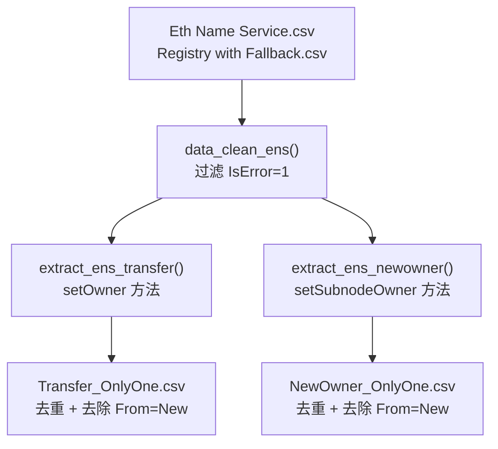

| 节点 | 含义 | Demo |
|------|------|------|
| E1 | ENS 两合约原始交易 | `Eth Name Service.csv`, `Registry with Fallback.csv` |
| CLEAN | 删除 `IsError=1` 失败交易 | — |
| EXT1 | 筛 `setOwner` → `Transfer.csv` | 见下方 Demo |
| EXT2 | 筛 `setSubnodeOwner` → `NewOwner.csv` | 子域分配 |
| T1 / T2 | 去 `From==New` 自转移；每 `From` 仅保留一条 | `Transfer_OnlyOne.csv` |

```
# ENS 转移 Demo（Transfer_OnlyOne 逻辑来源）
From: 0x8a582c1a18f7d381bf707cf0b535533016221398
New:  0x8472d6206f381ebf71a174b9de9e61b0e1962da4
Method: setOwner(bytes32 node, address owner)
```

**要点：** A 将域名转给 B → 链上公开暴露 **同一实体** 的两个地址，是后续正样本标签来源。

---

### 4.3 Step 3：Ground Truth 生成

**脚本：** `ground_truth_generate.py`

```bash
python ground_truth_generate.py
```

**关联规则：**

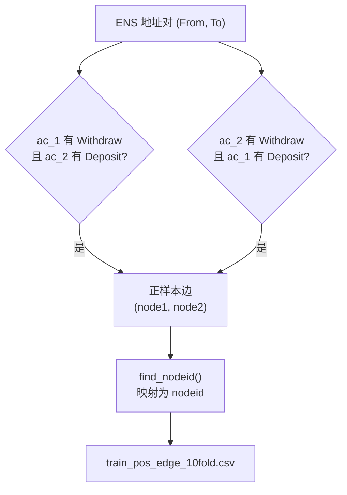

| 节点 | 含义 | Demo |
|------|------|------|
| ENS 地址对 | `(From, New)` 域名转移关系 | `From=0x8a58...`, `New=0x8472...` |
| R1 / R2 | 在 `ETH.csv` 验证：一方 Withdraw、另一方 Deposit | 过滤未使用 TC 的 ENS 对 |
| 正样本边 | 通过规则 → `ens_edge.csv`（0x 地址） | `Sender=0x9c1e38fb...`, `Receiver=0x98416a54...` |
| find_nodeid | 地址映射为图节点整数 ID | `nodeid` 来自 `node_feature_normalized.csv` |
| train_pos_edge | **训练正样本**（103 条） | 见下方 |
| train_neg_edge | **训练负样本**（103 条，随机无关联） | `nodeid1=25203, nodeid2=47658, label=0` |

```
# ens_edge.csv（中间产物，地址对）
Sender:   0x9c1e38fb29e4269292ae640b6e0f107dcc69535d
Receiver: 0x98416a54043d277dea1725fbba56e77b3fb64743

# train_pos_edge_10fold.csv（训练直接使用）
nodeid1 | nodeid2 | label
30926   | 65961   | 1
66825   | 50551   | 1
```

---

## 5. 特征提取

**脚本：** `feature_extract.py`

```bash
python feature_extract.py
```

### 5.1 特征提取流水线

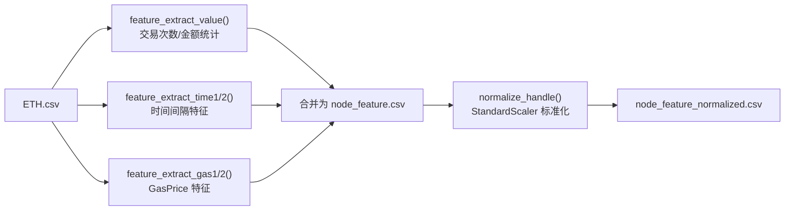

| 节点 | 含义 | Demo |
|------|------|------|
| ETH.csv | 全量 TC 流水，按 `From` 分组统计 | `Method=Withdraw`, `GasPrice=1.20e+11` |
| F1 value | 各池存/取款次数与金额加权 | `0.1_num`, `num_d_all`, `value_d` |
| F2 time | 首末时间、相邻交易间隔（全部/存/取） | `avg_time_gap_w` |
| F3 gas | GasPrice min/max/avg | `avg_gasprice_all` |
| MERGE | 按 `node` 地址合并 → `node_feature.csv` | 每行一个以太坊地址 |
| NORM | `StandardScaler` 标准化 | 输出 `node_feature_normalized.csv` |

```
# ETH.csv Demo
From: 0x000000000000123ca35c69ba3f852a46b2a27c94
To:   0x47ce0c6e...（1 ETH 池）  Method: Withdraw

# 标准化特征 Demo（节选）
nodeid=0 | node=0x000...27c94 | 0.1_num=-0.079 | num_all=-0.191 | avg_gasprice_all=0.803
```

### 5.2 节点特征维度（共 42 维，训练时使用）

| 特征组 | 字段 | 数量 |
|--------|------|------|
| 各池交易次数 | `0.1_num`, `1_num`, `10_num`, `100_num`, `num_all` | 5 |
| 各池存/取次数 | `*_num_d`, `*_num_w`（含分池及汇总） | 10 |
| Gas 价格 | `min/max/avg_gasprice_all/d/w` | 9 |
| 时间特征 | `early/late/total/min/max/avg_time_gap`（全部/存/取） | 18 |

> `data_process.py` 在加载时会丢弃 `node`, `value_d`, `value_w`, `avg_value_d`, `avg_value_w` 五列，最终输入 GNN 的特征维度为 **42**。

### 5.3 图数据对象（PyTorch Geometric）

`load_10_fold_data()` 构建的 `Data` 对象：

| 属性 | 形状 | 说明 |
|------|------|------|
| `x` | `[68419, 42]` | 全部节点特征矩阵 |
| `edge_index` | `[2, E]` | 当前折的边索引（训练 ~184-186，测试 ~20-22） |
| `edge_label` | `[E]` | 边标签（0/1） |
| `edge_label_index` | `[2, E]` | 待预测边的端点索引 |

---

## 6. 模型架构

**文件：** `model.py` — `GNN_NET`


| 节点 | 含义 | Demo |
|------|------|------|
| x [N,42] | 68,419 节点特征矩阵 | `x[0] = [-0.079, -0.017, ..., 0.803]` |
| SAGEConv 42→32 | 第 1 层邻居聚合 + ReLU | 感受野 +1 跳 |
| SAGEConv 32→16 | 第 2 层 → 嵌入 **z** | `z[i] ∈ R^16` |
| Decode | `score = sum(z[u] * z[v])` | 内积越大越像同一人 |
| sigmoid | 概率 ∈ [0,1] | `0.88` → 预测关联 |

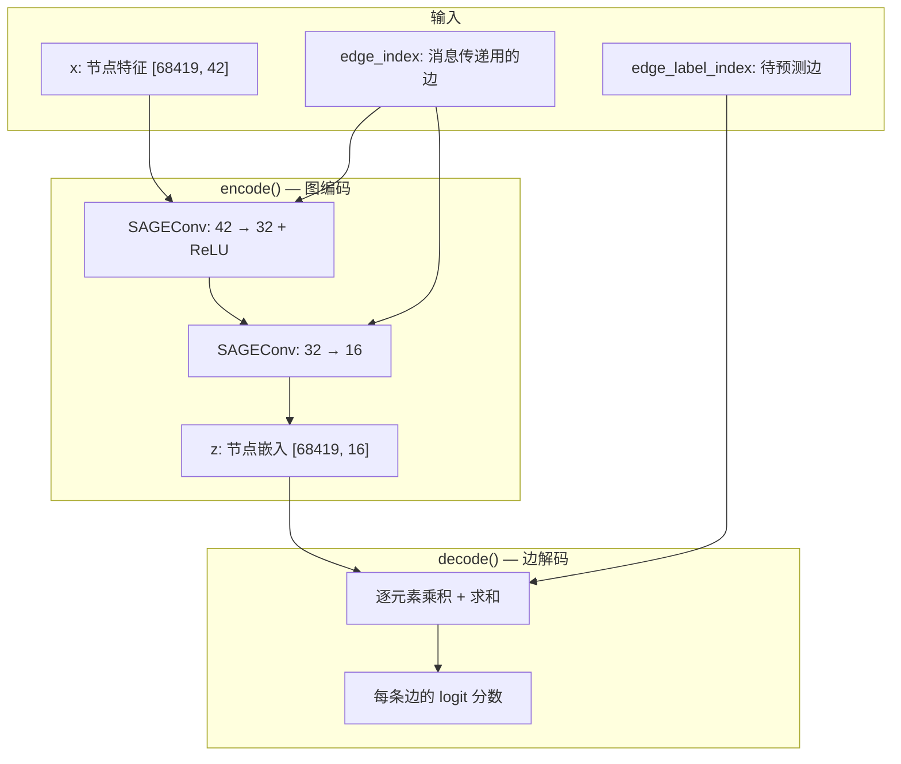

```
# 单边推理示例
边 (30926, 65961) → sigmoid(logit)=0.88 > 0.75 → 预测 label=1
```

| 组件 | 配置 |
|------|------|
| 图卷积层 | 2 层 GraphSAGE (`SAGEConv`) |
| 隐藏维度 | 32 → 16 |
| 解码器 | 源/目标节点嵌入逐元素乘积再求和 |
| 损失函数 | `BCEWithLogitsLoss` |
| 优化器 | Adam, lr=0.01 |
| 训练轮数 | 100 epochs / fold |
| 模型选择 | epoch > 10 后，取验证集 **F1 最高** 的 epoch |

---

## 7. 训练流程

**脚本：** `main.py`

```bash
conda activate mixbroker
cd /root/autodl-tmp/MixBroker-main
python main.py
```

### 7.1 10-Fold 交叉验证

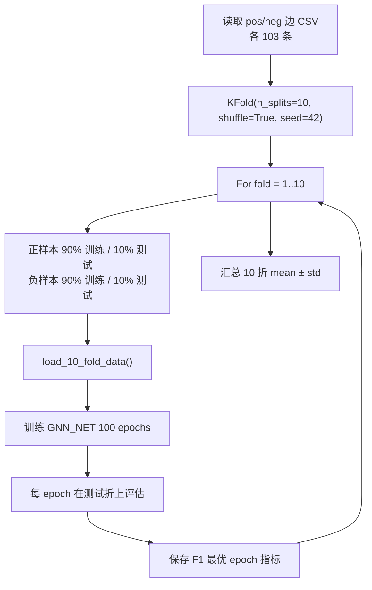

| 节点 | 含义 | Demo |
|------|------|------|
| 读取 pos/neg | 各 103 条标注边 | `train_pos/neg_edge_10fold.csv` |
| KFold | 10 折、seed=42；正负 **分别** 划分 | 每折 ~90% 训 / ~10% 测 |
| SPLIT | 合并当前折 train 边 | Fold1：184 训 / 22 测 |
| LOAD | 全图 `x` 不变，仅换当前折 `edge_index` | 见下方 `Data(...)` |
| TRAIN | 100 epoch，BCE loss，Adam lr=0.01 | GPU |
| BEST | epoch>10 后取 **test F1 最大** | Fold4：`epoch=13, F1=0.9524` |
| AGG | 10 折 mean±std | `mean F1=0.85, AUC=0.875` |

```
# Fold 1 图对象（训练日志）
训练: Data(x=[68419, 42], edge_index=[2, 184], edge_label=[184])
测试: Data(x=[68419, 42], edge_index=[2, 22],  edge_label=[22])
```

| 超参数 | 值 |
|--------|-----|
| 随机种子 | 1029 |
| KFold | 10 折, shuffle=True, random_state=42 |
| 每折训练边数 | ~184-186 |
| 每折测试边数 | ~20-22 |
| 最小选模 epoch | 11（前 10 epoch 不参与最优选择） |
| 设备 | CUDA（RTX 4080 SUPER） |

### 7.2 单折训练数据规模（实测）

| Fold | 训练边数 | 测试边数 | 最优 Epoch | 最优 F1 |
|------|---------|---------|-----------|---------|
| 1 | 184 | 22 | 11 | 0.8000 |
| 2 | 184 | 22 | 79 | 0.8889 |
| 3 | 184 | 22 | 38 | 0.8889 |
| 4 | 186 | 20 | 13 | 0.9524 |
| 5 | 186 | 20 | 15 | 0.8333 |
| 6 | 186 | 20 | 28 | 0.8889 |
| 7 | 186 | 20 | 14 | 0.9524 |
| 8 | 186 | 20 | 49 | 0.7619 |
| 9 | 186 | 20 | 17 | 0.7000 |
| 10 | 186 | 20 | 11 | 0.8333 |

> 总训练耗时：**~100 秒**（GPU）

---

## 8. 测试与评估

**函数：** `main.py` → `mytest()`

### 8.1 预测流程


| 节点 | 含义 | Demo |
|------|------|------|
| GNN_NET | 当前折最优 epoch 权重 | `model.eval()` |
| encode | 全图 `x` + `edge_index` → 嵌入 z | `z.shape=[68419,16]` |
| decode | 仅对测试边算 logit | 22 条边 → 22 个分数 |
| sigmoid | 转概率 | `[0.12, 0.88, 0.91, ...]` |
| 阈值 0.75 | `prob>0.75` → 预测 1 | 代码固定 |
| PRED | 对比真实 label 算 TP/FP/FN/TN | 见下方 |

```
真实 label=1, prob=0.88 → 预测 1 → TP
真实 label=0, prob=0.62 → 预测 0 → TN
真实 label=1, prob=0.70 → 预测 0 → FN（漏报）
```

### 8.2 评估指标

| 指标 | 公式 / 说明 |
|------|------------|
| Accuracy | (TP+TN) / 全部 |
| Precision | TP / (TP+FP) |
| Recall | TP / (TP+FN) |
| F1 | 2·P·R / (P+R) |
| FPR | FP / (FP+TN)，误报率 |
| FNR | FN / (TP+FN)，漏报率 |
| AUC | ROC 曲线下面积（基于 sigmoid 概率） |

**分类阈值：** sigmoid 输出 > **0.75** → 预测为关联（label=1）

---

## 9. 复现实验结果

### 9.1 10-Fold 详细结果

| Fold | Accuracy | Precision | Recall | F1 | FPR | FNR | AUC |
|------|----------|-----------|--------|-----|-----|-----|-----|
| 1 | 0.8000 | 0.8000 | 0.8000 | 0.8000 | 0.2000 | 0.2000 | 0.8400 |
| 2 | 0.9000 | 1.0000 | 0.8000 | 0.8889 | 0.0000 | 0.2000 | 0.9200 |
| 3 | 0.9000 | 1.0000 | 0.8000 | 0.8889 | 0.0000 | 0.2000 | 0.8900 |
| 4 | 0.9500 | 0.9091 | 1.0000 | 0.9524 | 0.1000 | 0.0000 | 0.9600 |
| 5 | 0.8000 | 0.7143 | 1.0000 | 0.8333 | 0.4000 | 0.0000 | 0.8700 |
| 6 | 0.9000 | 1.0000 | 0.8000 | 0.8889 | 0.0000 | 0.2000 | 0.8800 |
| 7 | 0.9500 | 0.9091 | 1.0000 | 0.9524 | 0.1000 | 0.0000 | 0.9600 |
| 8 | 0.7727 | 0.8000 | 0.7273 | 0.7619 | 0.1818 | 0.2727 | 0.8099 |
| 9 | 0.7273 | 0.7778 | 0.6364 | 0.7000 | 0.1818 | 0.3636 | 0.7934 |
| 10 | 0.8182 | 0.7692 | 0.9091 | 0.8333 | 0.2727 | 0.0909 | 0.8264 |

### 9.2 汇总统计（Mean ± Std）

| 指标 | Mean | Std |
|------|------|-----|
| **Accuracy** | **0.8518** | 0.0778 |
| **Precision** | **0.8679** | 0.1087 |
| **Recall** | **0.8473** | 0.1254 |
| **F1** | **0.8500** | 0.0808 |
| FPR | 0.1436 | 0.1309 |
| FNR | 0.1527 | 0.1254 |
| **AUC** | **0.8750** | 0.0589 |

### 9.3 结果可视化

#### 各折 F1 分数

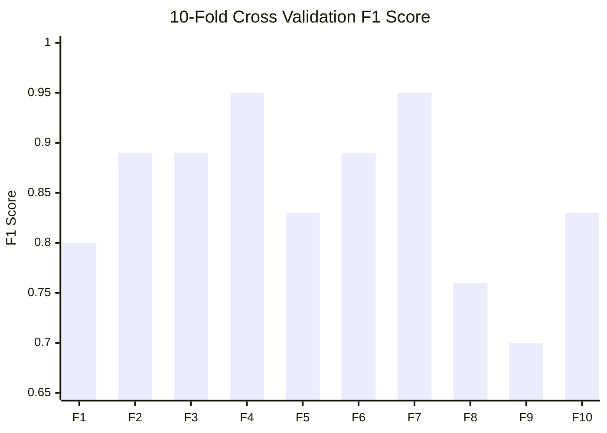

每折测试集最优 F1；Fold 4/7 最高（0.95），Fold 9 最低（0.70），小样本划分波动明显。

#### 各折 AUC

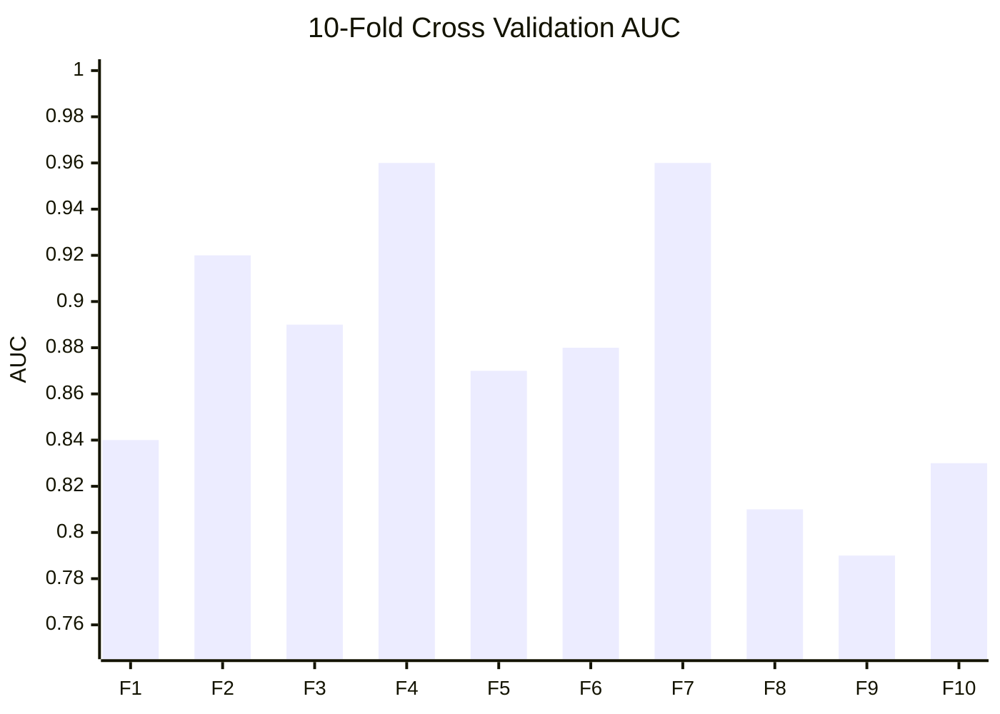

排序能力（不依赖固定阈值）；多数折 AUC > 0.85，与 F1 趋势一致。

#### 平均指标对比

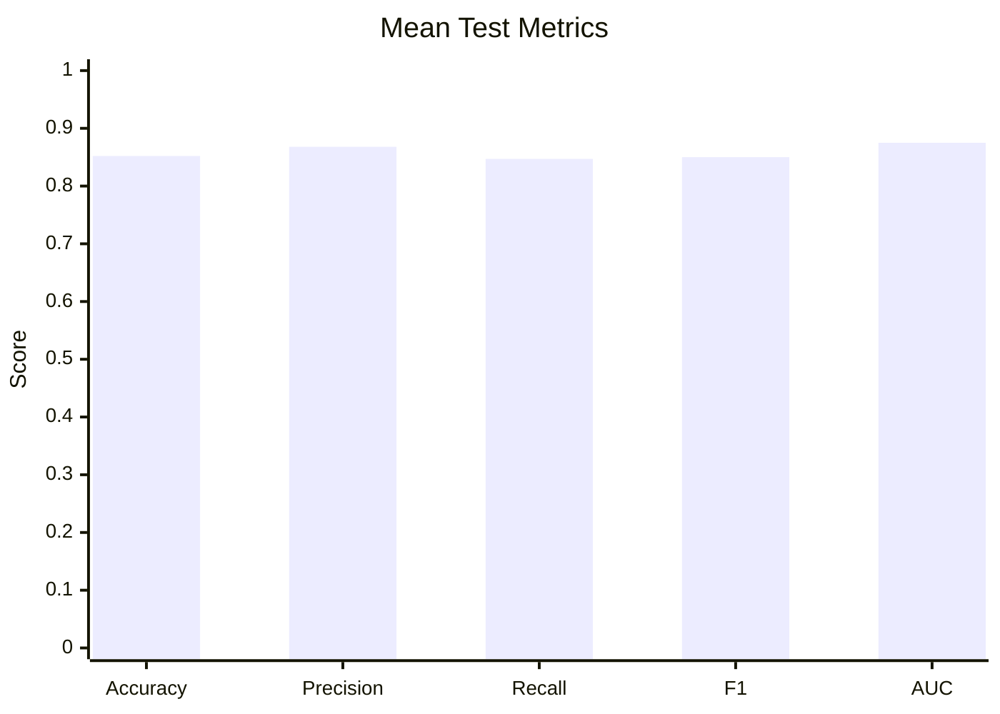

10 折汇总：Accuracy≈0.85，F1≈0.85，AUC≈0.88（详见 §9.2 表格）。

---

## 10. 一键复现命令清单

```bash
# 0. 激活环境（亦可：conda env create -f environment.yml）
conda activate mixbroker
cd /root/autodl-tmp/MixBroker-main

# 1. 数据准备（可选，仓库已含预处理数据）
python TC_data_prepare.py          # Step 1: TC 交易合并
python ENS_data_prepare.py         # Step 2: ENS 地址对
python ground_truth_generate.py    # Step 3: Ground Truth

# 2. 特征提取（可选，仓库已含 node_feature_normalized.csv）
python feature_extract.py

# 3. 训练 + 10-Fold 测试
python main.py
```

### 当前运行环境

| 组件 | 版本 |
|------|------|
| Python | 3.10.20 |
| PyTorch | 2.6.0+cu124 |
| PyTorch Geometric | 2.7.0 |
| NumPy | 1.26.4 |
| Pandas | 1.5.3 |
| scikit-learn | 1.0.2 |
| GPU | NVIDIA GeForce RTX 4080 SUPER |
| CUDA Runtime | 12.4 |

> 依赖锁定文件：`environment.yml`

---

## 11. 输出文件

| 文件 | 说明 |
|------|------|
| `training_output.log` | 首次训练完整控制台日志 |
| `training_results_10fold.csv` | 10 折指标 CSV（可导入 Excel / 绘图） |
| `Dataset/Graph_original_backup/` | 论文原版 Graph 数据备份 |

---

## 12. 关键代码入口

| 文件 | 入口函数 | 职责 |
|------|----------|------|
| `TC_data_prepare.py` | `data_concat()` | TC 内外部交易合并 |
| `ENS_data_prepare.py` | `name_transfer()` 等 | ENS 数据清洗与地址对提取 |
| `ground_truth_generate.py` | `ground_truth_generate()` | 正样本边生成 |
| `feature_extract.py` | `normalize_handle()` 等 | 节点特征提取与标准化 |
| `data_process.py` | `load_10_fold_data()` | 构建 PyG 图数据 |
| `model.py` | `GNN_NET` | GraphSAGE 边分类模型 |
| `main.py` | `train_10_fold()` | 10 折训练与评估 |

---

## 13. 结论

本次在 RTX 4080 SUPER 上成功复现 MixBroker 10-Fold 训练流程：

- **68,419** 个地址节点，**42** 维图特征
- **206** 条标注边（103 正 + 103 负），10 折交叉验证
- 平均 **F1 = 0.8500**，**AUC = 0.8750**
- 单轮完整训练约 **100 秒**

模型能够有效利用 Tornado Cash 交易图上的行为特征（交易频率、金额、Gas、时间模式），结合 GraphSAGE 邻居聚合，对 ENS 暴露的地址关联进行高精度识别，验证了论文提出的图特征学习去匿名化方案的可行性。

---

# 附录：代码级复现详解（函数 / 字段 / 张量级）

> 本附录在第一部分流程说明之上，补充**可独立复现论文**所需的代码路径、列下标、张量形状与排错说明。与 §1–§13 对照阅读即可。

## 附录目录

- [§A.1 任务与数据流（代码视角）](#a1-任务与数据流代码视角)
- [§A.2 环境与目录](#a2-环境与目录)
- [§A.3 原始数据采集字段](#a3-原始数据采集字段)
- [§A.4 TC_data_prepare 代码逻辑](#a4-tc_data_prepare-代码逻辑)
- [§A.5 ENS_data_prepare 执行顺序](#a5-ens_data_prepare-执行顺序)
- [§A.6 构建 ETH.csv](#a6-构建-ethcsv)
- [§A.7 Ground Truth 与负样本脚本](#a7-ground-truth-与负样本脚本)
- [§A.8 特征提取逐步命令](#a8-特征提取逐步命令)
- [§A.9 归一化](#a9-归一化)
- [§A.10 load_10_fold_data 源码级说明](#a10-load_10_fold_data-源码级说明)
- [§A.11 GNN_NET 源码级说明](#a11-gnn_net-源码级说明)
- [§A.12 train_10_fold 与 mytest](#a12-train_10_fold-与-mytest)
- [§A.13 复现路径与检查清单](#a13-复现路径与检查清单)
- [§A.14 已知问题与排错](#a14-已知问题与排错)
- [§A.15 扩展实验（TC-Linkage）](#a15-扩展实验tc-linkage)

---

## A.1 任务与数据流（代码视角）

| 概念 | 代码/文件中的实现 |
|------|-------------------|
| **节点** | `node_feature_normalized.csv` 中每个 `nodeid` |
| **消息传递边** | 当前折 `Data.edge_index` |
| **待预测边** | `edge_label_index`（本实现与 `edge_index` 相同） |
| **正样本** | ENS + TC 存取款规则 → `train_pos_edge_10fold.csv` |
| **负样本** | 随机采样 → `train_neg_edge_10fold.csv` |

四个池合约地址（`feature_extract.py` 内小写匹配 `To`）见正文 **§3.2**。

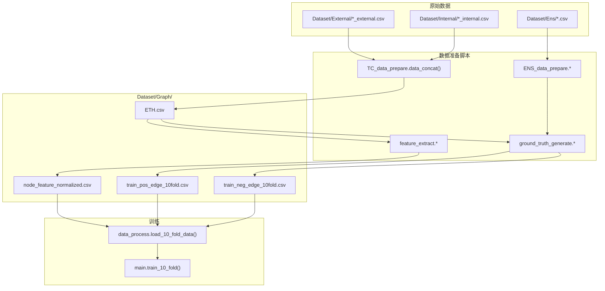

---

## A.2 环境与目录

```bash
cd /root/autodl-tmp/MixBroker-main
conda env create -f environment.yml
conda activate mixbroker
```

**所有脚本在仓库根目录执行**（相对路径 `./Dataset/...`）。

| 组件 | 版本 |
|------|------|
| Python | 3.10.20 |
| PyTorch | 2.6.0+cu124 |
| PyTorch Geometric | 2.7.0 |
| Pandas | 1.5.3 |
| scikit-learn | 1.0.2 |

预置论文数据备份：`Dataset/Graph_original_backup/`（68,419 节点，103+103 边）。

---

## A.3 原始数据采集字段

### External（`0.1ETH_external.csv`）

```text
,Txhash,UnixTimestamp,DateTime,From,To,Value_IN(ETH),Value_OUT(ETH),TxnFee(ETH),Method,GasPrice
```

### Internal

同结构，Withdraw 时常为池 → 用户；合并后统一为 **`From` = 用户地址**（见 §A.4）。

### ENS 清洗入口列

`ENS_data_prepare.data_clean_ens()`：`usecols=[0,2,4,5,6,12,13]`，删除 `IsError==1`。

---

## A.4 TC_data_prepare 代码逻辑

```bash
python TC_data_prepare.py
```

`data_concat()` 对 `[0.1, 1, 10, 100]` 各输出 `{val}ETH-concat.csv` 与 `{val}ETH-relayer.csv`。

**External `itertuples` 下标：**

| 变量 | 列 |
|------|-----|
| `row_ex[2]` | Txhash |
| `row_ex[3]` | UnixTimestamp |
| `row_ex[4]` | DateTime |
| `row_ex[5]` | From |
| `row_ex[6]` | To |
| `row_ex[7]` | Value_IN |
| `row_ex[8]` | Value_OUT |
| `row_ex[10]` | Method |

**循环一（External）**：按 Txhash 匹配 Internal；若恰 2 条 Internal → Relayer 分支写入 concat + relayer；否则仅 External 行。

**循环二（剩余 Internal）**：`num==2` 为 Withdraw+Relayer；否则按金额列判断 Deposit/Withdraw。

**concat 列名：**

```python
['Txhash', 'UnixTimestamp', 'DateTime', 'From', 'To', 'Value_IN', 'Value_OUT', 'Method']
```

---

## A.5 ENS_data_prepare 执行顺序

```bash
python -c "from ENS_data_prepare import data_clean_ens; data_clean_ens('Eth Name Service_NormalTx.csv')"
python -c "from ENS_data_prepare import data_clean_ens; data_clean_ens('Registry with Fallback_NormalTx.csv')"
python -c "from ENS_data_prepare import extract_ens_transfer, extract_ens_newowner; extract_ens_transfer(); extract_ens_newowner()"
python -c "from ENS_data_prepare import name_transfer, subdomain_assignment; name_transfer(); subdomain_assignment()"
```

| 函数 | 输出 |
|------|------|
| `extract_ens_transfer()` | `Transfer.csv`（`setOwner(...)`） |
| `extract_ens_newowner()` | `NewOwner.csv`（`setSubnodeOwner(...)`） |
| `name_transfer()` | `Transfer_OnlyOne.csv` |
| `subdomain_assignment()` | `NewOwner_OnlyOne.csv` |

---

## A.6 构建 ETH.csv

```bash
python -c "from feature_extract import concat_all; concat_all()"
```

逻辑：合并四池 `*ETH-concat.csv`，与 `*ETH-external-gas.csv` 按 `Txhash` 合并 `GasPrice`，排序后写入 `Dataset/Graph/ETH.csv`。

> 若缺少 `external-gas` 文件，可直接使用 `Graph_original_backup/ETH.csv`，或从 External 表 `GasPrice` 列自行 merge。

---

## A.7 Ground Truth 与负样本脚本

### 正样本：`ground_truth_generate()`

```bash
python -c "from ground_truth_generate import ground_truth_generate; ground_truth_generate()"
```

规则（对每个 ENS 对 `ac_1, ac_2`）：

- R1：`ac_1` 有 Withdraw 且 `ac_2` 有 Deposit → `[ac_2, ac_1]`
- R2：`ac_2` 有 Withdraw 且 `ac_1` 有 Deposit → `[ac_1, ac_2]`

**复现必改 L43：**

```python
df_new_1.columns = ['Sender', 'Receiver']
df_new_1.to_csv('./Dataset/Graph/ens_edge.csv', index=True)
```

### 映射 nodeid：`find_nodeid()`

```bash
python -c "from ground_truth_generate import find_nodeid; find_nodeid()"
```

依赖已存在的 `node_feature_normalized.csv`。

### 负样本（仓库无独立脚本，可自生成）

```python
import pandas as pd, numpy as np
pos = pd.read_csv('./Dataset/Graph/train_pos_edge_10fold.csv')
nf = pd.read_csv('./Dataset/Graph/node_feature_normalized.csv')
node_ids = nf['nodeid'].tolist()
pos_set = set(zip(pos['nodeid1'], pos['nodeid2'])) | set(zip(pos['nodeid2'], pos['nodeid1']))
rng = np.random.RandomState(42)
neg_rows = []
while len(neg_rows) < len(pos):
    a, b = rng.choice(node_ids, 2, replace=False)
    if a != b and (a, b) not in pos_set:
        neg_rows.append({'nodeid1': a, 'nodeid2': b, 'label': 0})
pd.DataFrame(neg_rows).to_csv('./Dataset/Graph/train_neg_edge_10fold.csv', index=True)
```

---

## A.8 特征提取逐步命令

```bash
python -c "from feature_extract import feature_extract_value; feature_extract_value()"

python -c "
import pandas as pd
df = pd.read_csv('./Dataset/Graph/node_feature.csv')
df = df.sort_values('node').reset_index(drop=True)
df.insert(0, 'nodeid', range(len(df)))
df.to_csv('./Dataset/Graph/node_feature.csv', index=False)
df.to_csv('./Dataset/Graph/node_feature_copy.csv', index=False)
"

python -c "from feature_extract import feature_extract_time1, feature_extract_time2; feature_extract_time1(); feature_extract_time2()"

python -c "
import pandas as pd
copy = pd.read_csv('./Dataset/Graph/node_feature_copy.csv')
main = pd.read_csv('./Dataset/Graph/node_feature.csv')
time_cols = [c for c in copy.columns if c not in main.columns and c != 'nodeid']
main = main.merge(copy[['node'] + time_cols], on='node', how='left')
main.to_csv('./Dataset/Graph/node_feature.csv', index=False)
"

python -c "from feature_extract import feature_extract_gas1, feature_extract_gas2; feature_extract_gas1(); feature_extract_gas2()"

python -c "from feature_extract import normalize_handle; normalize_handle()"
```

**`feature_extract_value` 要点：** 按 `From` 分组；按 `To` 识别四池；统计 `*_num`, `*_num_d/w`, `value_d/w`, `avg_value_d/w`。

**注意：** 当前仓库 `feature_extract_time2` / `feature_extract_gas2` **仅实现 Withdraw 循环**；论文 42 维中的 `*_d` 存/取时间/Gas 在预置 `Graph_original_backup/node_feature.csv` 中已齐全。从零重建建议直接用备份或补全 Deposit 循环（§A.14）。

---

## A.9 归一化

`normalize_handle()`：

```python
df_feature = read('node_feature.csv').drop(columns=['nodeid','node'])
X_scaled = StandardScaler().fit_transform(df_feature)
# 拼回 nodeid, node → node_feature_normalized.csv
```

训练时 `data_process.py` 再丢弃：`node`, `value_d`, `value_w`, `avg_value_d`, `avg_value_w` → **GNN 输入 42 维**。

---

## A.10 load_10_fold_data 源码级说明

```python
def load_10_fold_data(t_edge):
    t_data = pd.read_csv('./Dataset/Graph/node_feature_normalized.csv')
    t_data = t_data.drop(columns=['node', 'value_d', 'value_w', 'avg_value_d', 'avg_value_w'])

    texId2index = {int(row.iloc[0]): index for index, row in t_data.iterrows()}

    x = t_data.iloc[:, 1:].to_numpy(np.float32)
    x[np.isinf(x)] = 1.0; x[np.isnan(x)] = 0.0

    for _, row in t_edge.iterrows():
        id_1, id_2, label = int(row.iloc[0]), int(row.iloc[1]), int(row.iloc[2])
        if id_1 in texId2index and id_2 in texId2index:
            edges.append((texId2index[id_1], texId2index[id_2]))
            labels.append(label)

    return Data(x=x, edge_index=edges.T, edge_label=labels, edge_label_index=edges.T)
```

| 属性 | 典型 Shape |
|------|------------|
| `x` | `[68419, 42]` |
| `edge_index` | `[2, E]`，E≈184（训）/ 22（测） |

---

## A.11 GNN_NET 源码级说明

```python
class GNN_NET(torch.nn.Module):
    def __init__(self, in_channels, hidden_channels, out_channels):
        self.conv1 = SAGEConv(in_channels, hidden_channels)   # 42→32
        self.conv2 = SAGEConv(hidden_channels, out_channels)   # 32→16

    def encode(self, x, edge_index):
        x = self.conv1(x, edge_index).relu()
        return self.conv2(x, edge_index)

    def decode(self, z, edge_label_index):
        src = z[edge_label_index[0]]
        dst = z[edge_label_index[1]]
        return (src * dst).sum(dim=-1)
```

`main.py`：`GNN_NET(train_data.num_features, 32, 16)`，`BCEWithLogitsLoss`，Adam `lr=0.01`。

---

## A.12 train_10_fold 与 mytest

```python
# 种子
seed_torch(1029)

# KFold：正负分别 10 折，random_state=42
skf = KFold(n_splits=10, shuffle=True, random_state=42)

# 每折：100 epoch，epoch>10 后按 test F1 选最优
for epoch in range(1, 101):
    loss = BCEWithLogitsLoss()(model(...), train_data.edge_label)
    mytest(model, test_data)  # 更新 best_test_f_1
```

**mytest 阈值：**

```python
label_pred = (sigmoid(decode(...)) > 0.75).astype(int)
```

指标：Accuracy, Precision, Recall, F1, FPR, FNR, AUC（`sklearn.metrics` + 手写 TP/FP/FN/TN）。

---

## A.13 复现路径与检查清单

### 路径 A：预置数据（推荐，对应正文 §10）

```bash
conda activate mixbroker
cd /root/autodl-tmp/MixBroker-main
cp Dataset/Graph_original_backup/ETH.csv Dataset/Graph/
cp Dataset/Graph_original_backup/node_feature.csv Dataset/Graph/
cp Dataset/Graph_original_backup/node_feature_normalized.csv Dataset/Graph/
cp Dataset/Graph_original_backup/train_pos_edge_10fold.csv Dataset/Graph/
cp Dataset/Graph_original_backup/train_neg_edge_10fold.csv Dataset/Graph/
python main.py
```

### 路径 B：从零重建

按 §A.4 → §A.5 → §A.6 → §A.7（含负样本脚本）→ §A.8 → `python main.py`。

### 检查清单

| 检查项 | 预期 |
|--------|------|
| 节点数 | 68419 |
| `x` 特征维 | 42 |
| 正/负边 | 各 103 |
| mean F1 | ≈ 0.85（§9.2） |

---

## A.14 已知问题与排错

| 问题 | 处理 |
|------|------|
| `ground_truth_generate` L43 `df_new` 未定义 | 改为 `df_new_1.to_csv(...)`，列名 Sender/Receiver |
| `time2`/`gas2` 仅 Withdraw | 用 `Graph_original_backup` 或补 Deposit 循环 |
| `time1` 首次 drop 列 KeyError | 已修复为只删存在列；或先复制 `node_feature_copy.csv` |
| `Graph/` 被 TC-Linkage 覆盖 | 恢复 `Graph_original_backup/` |
| `np.random.seed = seed` | 建议改为 `np.random.seed(seed)` |

---

## A.15 扩展实验（TC-Linkage）

以下脚本**不属于论文原文流程**，勿与 §10 混用同一 `Dataset/Graph/`：

| 文件 | 用途 |
|------|------|
| `tc_linkage_prepare.py` | TC-Linkage 数据适配 |
| `run_tc_linkage_training.py` | TC 数据训练 + 报告 |
| `run_scaling_law.py` | 样本规模 scaling law |
| `TC_Linkage_scaling_law_report.md` | Scaling 实验报告 |

---

*附录与仓库 `.py` 同步；代码变更时请同时更新正文与附录对应小节。*
